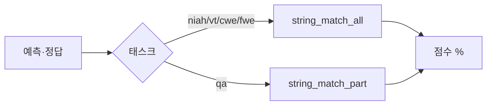

# `benchmark/ruler/eval/synthetic/constants.py` 분석

## 개요
RULER 채점에 쓰는 **태스크별 지표 함수 매핑 테이블(`TASKS`)** 입니다. 각 합성 태스크가 어떤 채점 함수를 쓸지 정의합니다.

## 구성 요소
| 함수 | 채점 방식 |
|---|---|
| `string_match_all(preds, refs)` | 정답 후보들의 **평균 포함 비율**(niah/vt/cwe/fwe) |
| `string_match_part(preds, refs)` | 정답 후보 중 **하나라도 포함되면 1점**(qa) |
| `TASKS` | 태스크→`metric_fn` 매핑 |

## 블록 다이어그램

## 주의
- `evaluate.py`가 이 `metric_fn`을 호출해 채점. 데이터 생성용 `data/synthetic/constants.py`(템플릿)와는 별개 파일입니다.
- 대소문자 무시 부분 문자열 일치 기반의 단순·견고한 채점.
