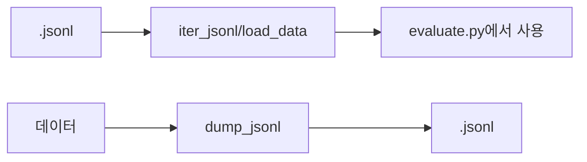

# `benchmark/ruler/eval/utils.py` 분석

## 개요
RULER 채점 단계의 **jsonl 입출력 유틸리티**입니다. 작은 헬퍼 모듈입니다.

## 함수
| 함수 | 역할 |
|---|---|
| `dump_jsonl(fname, data)` | 리스트를 줄 단위 JSON으로 저장 |
| `iter_jsonl(fname, cnt)` | jsonl을 줄 단위로 파싱하는 제너레이터 |
| `load_data(fname)` | `iter_jsonl` 결과를 리스트로 반환 |

## 블록 다이어그램

## 주의
GPU/외부 의존성 없음. `evaluate.py`의 예측 로딩·청크 병합에 사용됩니다.
