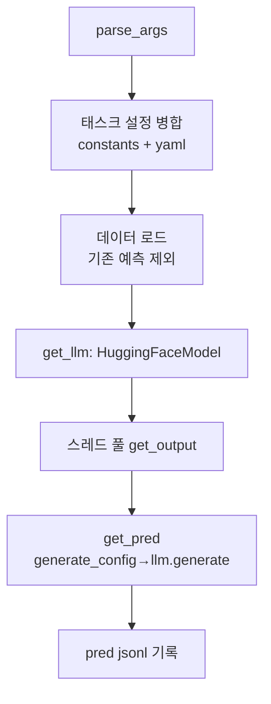

# `benchmark/ruler/pred/call_api.py` 분석

## 개요
[RULER](https://github.com/NVIDIA/RULER) 벤치마크에서 **예측 jsonl을 생성하는 실행 스크립트**입니다(NVIDIA 원본 이식). RetroInfer 모델(`hf` 서버 타입)을 로드해 각 태스크 입력에 대한 응답을 생성하고, 멀티스레드로 배치를 처리해 결과를 저장합니다.

## 주요 구성 요소
| 구성 | 역할 |
|---|---|
| `SERVER_TYPES` | 지원 백엔드 목록(RULER 상속: trtllm/vllm/openai/gemini/hf/mamba). 여기선 `hf`만 실제 사용 |
| `HuggingFaceModel` | RetroInfer `LlamaModel`/`QwenModel`을 감싼 호출 가능 래퍼 |
| `get_llm(...)` | server_type=`hf`일 때 위 래퍼 생성 |
| `get_pred(...)` | 토크나이즈 → `generate_config` → `llm.generate` → 디코딩 |
| `get_output(...)` | 스레드 워커: 예외 시 재시도, 결과를 `outputs_parallel`에 기록 |
| `main(args)` | 태스크 설정 로드, 데이터 로드(기존 예측 스킵), 스레드 풀로 예측 실행 |

## 핵심 로직
- `--benchmark`의 `constants.TASKS` + `<benchmark>.yaml`로 태스크 설정 병합.
- `--threads`개 스레드로 병렬 생성(`hf`는 1로 강제), 완료분을 buffering=1로 즉시 flush.
- `synthetic_len`으로 `generate_config` 호출(RetroInfer 클러스터 파라미터 결정).

## 블록 다이어그램

## 의존성 · 주의
- `model_hub`, `config`, `pred/utils.load_data`에 의존. CUDA GPU 필요.
- `--prefill_method`(full/xattn/minfer), `--attn_type`(Full_Flash_Attn/RetroInfer) 지원. 출력은 `eval/evaluate.py`가 채점.
