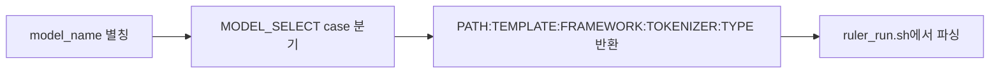

# `benchmark/ruler/ruler_config_models.sh` 분석

## 개요
RULER 실행에 필요한 **모델 설정 조회 함수(`MODEL_SELECT`)를 정의하는 config 스크립트**입니다(NVIDIA 원본 이식). `ruler_run.sh`가 `source`로 불러와 사용합니다.

## 구성 요소
`MODEL_SELECT(model_name)` — 모델 별칭을 받아 다음을 `:`로 구분해 echo:
- `MODEL_PATH`, `MODEL_TEMPLATE_TYPE`(meta-chat), `MODEL_FRAMEWORK`(hf), `TOKENIZER_PATH`, `TOKENIZER_TYPE`(hf).

지원 모델: `qwen2.5-7b`, `llama-3-8b-1048k`, `llama-3.1-8b`, `qwen2.5-72b`.

## 블록 다이어그램

## 주의
- 순수 설정 함수(실행 로직 없음). 새 모델 추가 시 여기 `case`에 항목을 넣습니다.
- 모든 모델이 `meta-chat` 템플릿 + `hf` 프레임워크를 사용.
