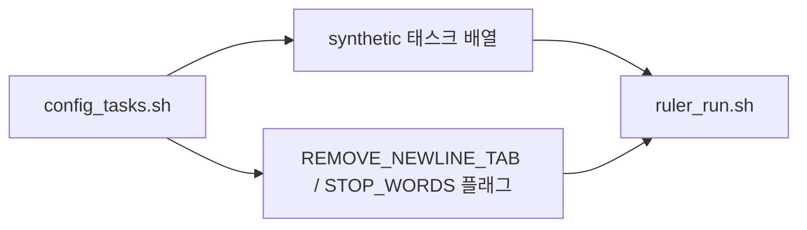

# `benchmark/ruler/ruler_config_tasks.sh` 분석

## 개요
RULER 실행에 필요한 **태스크 목록·공통 옵션을 정의하는 config 스크립트**입니다(NVIDIA 원본 이식). `ruler_run.sh`가 `source`로 불러옵니다.

## 구성 요소
| 변수 | 내용 |
|---|---|
| `synthetic` | 실행 대상 태스크 배열(niah_single_1~3, niah_multikey_1~3, niah_multivalue, niah_multiquery, vt, cwe, fwe, qa_1, qa_2) |
| `REMOVE_NEWLINE_TAB` | 문자열 내 개행/탭 제거 여부 → 플래그 문자열로 변환 |
| `STOP_WORDS` | 정지 단어 옵션(기본 비어 있음) |

## 블록 다이어그램

## 주의
- 순수 설정 파일. `synthetic.yaml`의 태스크 이름과 일치해야 합니다.
- 태스크 배열은 `declare -n TASKS=$BENCHMARK`로 `ruler_run.sh`에서 참조됩니다.
