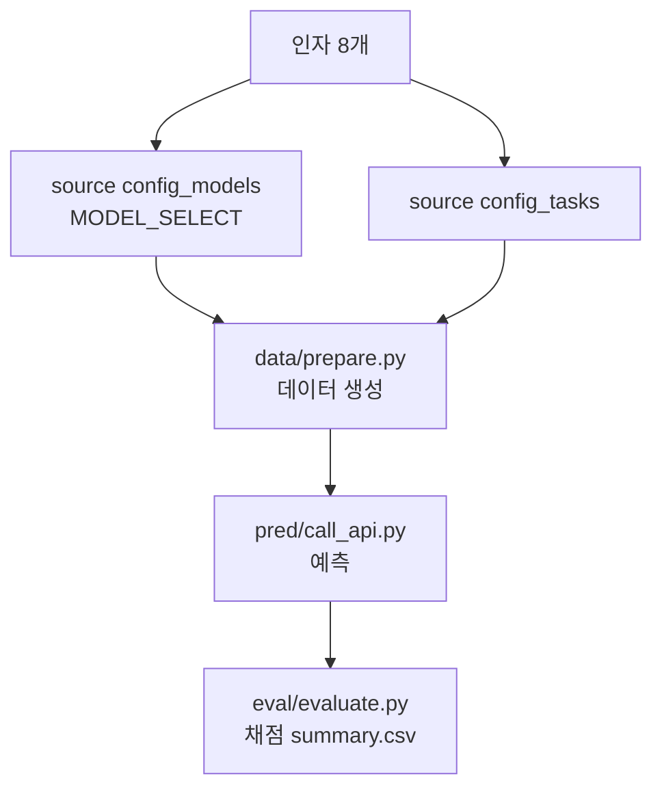

# `benchmark/ruler/ruler_run.sh` 분석

## 개요
RULER 벤치마크의 **엔드투엔드 실행 스크립트**입니다(NVIDIA 원본 이식). 데이터 준비 → 예측 → 채점의 3단계를 한 번에 수행합니다. 모델·태스크 설정은 별도 config 스크립트에서 로드합니다.

## 인자 (8개)
`<model_name> <prefill_method> <attn_type> <context_length> <task> <dtype> <budget_ratio> <estimate_ratio>`

## 핵심 로직
1. `source ruler_config_models.sh` → `MODEL_SELECT`로 모델 경로/템플릿/토크나이저 확정.
2. `source ruler_config_tasks.sh` → 태스크 목록·옵션 로드.
3. 결과 디렉터리 초기화(data/pred).
4. `data/prepare.py`로 합성 데이터 생성(`NUM_SAMPLES=200`).
5. `pred/call_api.py`로 예측 생성(`server_type=hf`, `--device auto`).
6. `eval/evaluate.py`로 채점.

## 블록 다이어그램

## 의존성 · 주의
- `ruler_config_models.sh`, `ruler_config_tasks.sh`, `data/prepare.py`, `pred/call_api.py`, `eval/evaluate.py`에 의존. 예측 단계는 CUDA GPU 필요.
- README의 `ruler_run.sh llama-3-8b-1048k full RetroInfer 131072 vt bf16 0.018 0.232` 예시에 해당.
