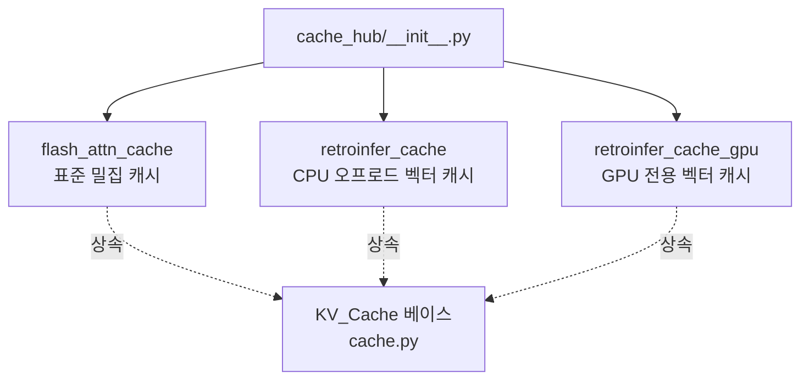

# `cache_hub/__init__.py` 분석

## 개요
`cache_hub` 패키지의 export 관문입니다. 세 가지 KV 캐시 구현을 노출합니다.

## export 대상
| 심볼 | 파일 | 용도 |
|---|---|---|
| `flash_attn_cache` | `flash_attn_cache.py` | Full FlashAttention용 표준 KV 캐시 |
| `retroinfer_cache` | `retroinfer_cache.py` | RetroInfer의 CPU 오프로드(GPU–CPU 협력) 벡터 캐시 |
| `retroinfer_cache_gpu` | `retroinfer_cache_gpu.py` | RetroInfer의 GPU 전용(`--gpu_only`) 벡터 캐시 |

## 블록 다이어그램

## 주의
세 클래스 모두 `cache.py`의 `KV_Cache` 베이스를 상속합니다. `model_hub/llama.py`·`qwen.py`가 `attention_type`/`gpu_only`에 따라 적절한 캐시를 선택합니다.
