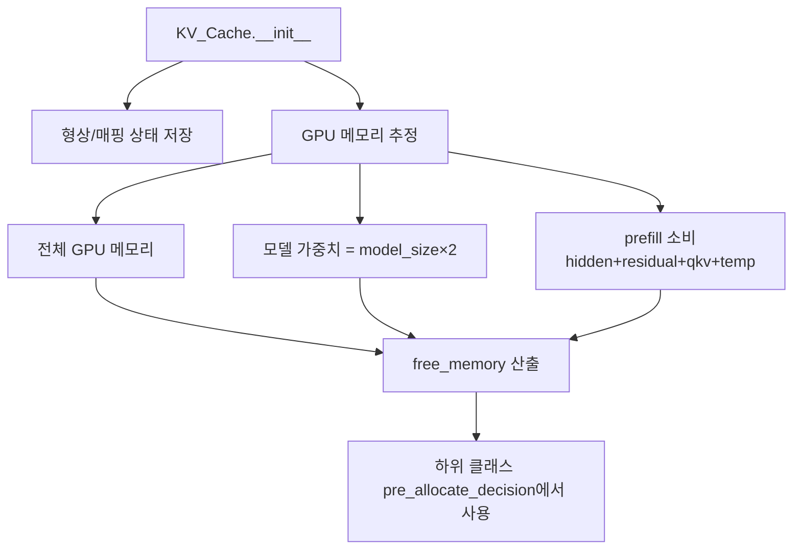

# `cache_hub/cache.py` 분석

## 개요
모든 KV 캐시 구현의 **추상 베이스 클래스 `KV_Cache`** 입니다. 캐시가 공통으로 갖는 형상 정보(레이어 수, 배치, 헤드, head_dim, dtype 등)를 보관하고, **prefill 단계의 GPU 여유 메모리를 추정**합니다. 이 추정값은 하위 클래스가 KV를 GPU에 사전 할당할지(CPU로 오프로드할지) 결정하는 데 쓰입니다.

## 생성자가 저장하는 핵심 상태
| 필드 | 의미 |
|---|---|
| `layer_num`, `batch_size`, `max_length` | 시퀀스/모델 형상 |
| `kv_head`, `num_heads`, `head_dim` | (GQA 포함) 어텐션 헤드 형상 |
| `layer_mapping` | 레이어 → GPU device 매핑(멀티 GPU 분산) |
| `prefill_bsz` | prefill 시 배치 크기(`min(prefill_bsz, batch_size)`) |
| `num_gpus`, `model_size` | 메모리 추정 입력 |
| `free_memory` | 아래 공식으로 산출한 prefill 중 GPU 여유 메모리(GB) |

## 메모리 추정 로직
`free_memory = 전체 GPU 메모리 − 모델 가중치(model_size×2) − prefill 소비량×num_gpus`
- prefill 소비량 = hidden + residual + qkv + temp 버퍼(각각 형상×2바이트로 계산).
- 이 값이 하위 클래스의 `pre_allocate_decision()`에서 KV 캐시 예상 사용량과 비교됩니다.

## 블록 다이어그램

## 주의
이 클래스 자체는 KV 텐서를 생성하지 않습니다. 실제 할당·업데이트·어텐션은 `flash_attn_cache`/`retroinfer_cache`/`retroinfer_cache_gpu`가 담당합니다.
