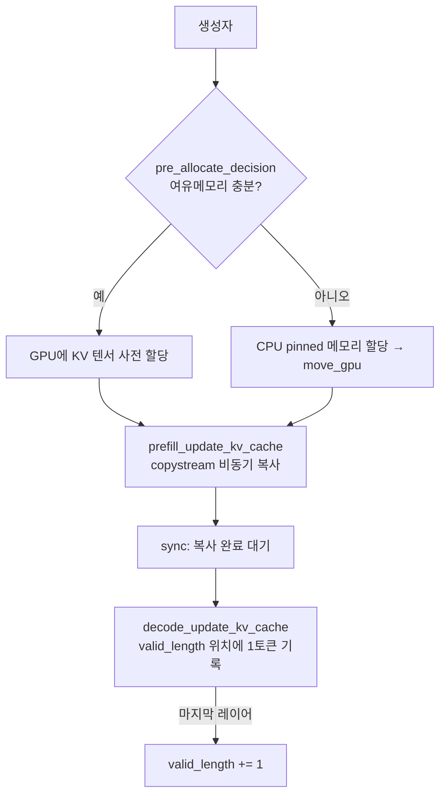

# `cache_hub/flash_attn_cache.py` 분석

## 개요
`KV_Cache`를 상속한 **Full FlashAttention용 표준 KV 캐시**입니다(`attn_type='Full_Flash_Attn'`). 모든 토큰의 Key/Value를 그대로 저장하며, GPU 여유 메모리에 따라 GPU 사전 할당 또는 CPU pinned 메모리 오프로드를 선택합니다. 별도의 CUDA 스트림/이벤트로 KV 복사와 연산을 겹칩니다.

## 주요 메서드
| 메서드 | 역할 |
|---|---|
| `pre_allocate_decision()` | KV 예상 사용량×1.3 < 여유 메모리이면 GPU 사전 할당 결정 |
| `move_gpu()` | 오프로드 상태였다면 각 레이어 캐시를 해당 device로 이동 |
| `prefill_update_kv_cache(...)` | prefill 시 유효 토큰 구간을 캐시에 복사(패딩 `valid_start` 제외), copystream으로 비동기 처리 |
| `sync(...)` | 복사 완료 이벤트 대기 |
| `decode_update_kv_cache(...)` | 디코딩 1스텝의 K/V를 `valid_length` 위치에 기록, 마지막 레이어에서 길이 증가 |

## 핵심 로직
- **유효 길이 관리**: 좌측 패딩을 고려해 배치별 `valid_start_list`/`valid_length`를 유지. 디코딩마다 `valid_length`를 device별로 +1.
- **비동기 복사**: `copystream` + `KVreadyevents`/`copyevents`로 KV 준비·복사·동기화를 파이프라인화.

## 블록 다이어그램

## 주의
실제 어텐션 계산은 이 캐시가 반환하는 `key_cache`/`value_cache`를 `attn_hub/full_attn.py`의 `flash_attn_with_kvcache`가 소비하여 수행합니다.
