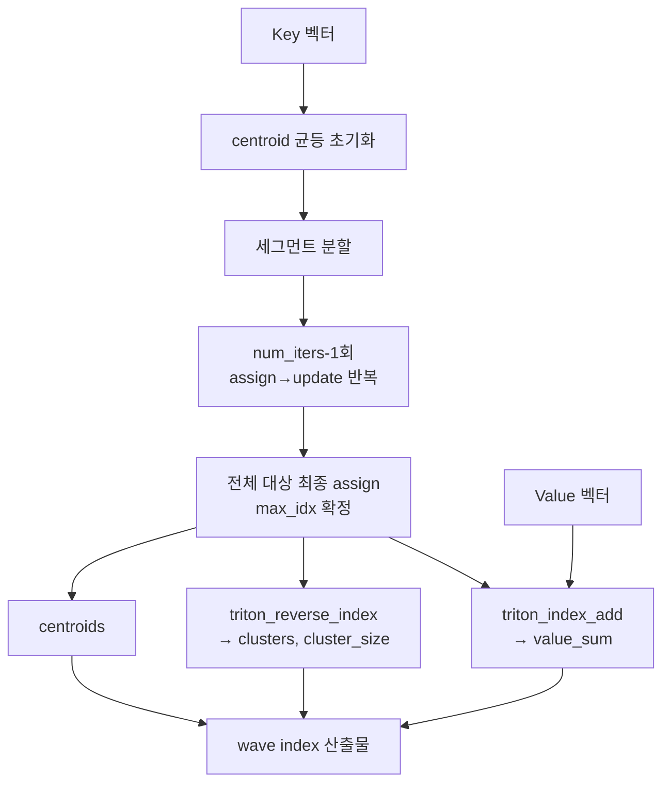

# `cache_hub/kmeans.py` 분석

## 개요
RetroInfer의 **wave index(벡터 인덱스)를 구축하는 분할 클러스터링(segmented k-means)** 구현입니다. 전부 Triton 커널로 가속되어, 긴 컨텍스트의 Key 벡터를 저비용으로 클러스터링하고 각 클러스터의 centroid·value 합·역인덱스(cluster membership)를 산출합니다.

## Triton 커널 · 함수
| 구성 | 역할 |
|---|---|
| `_triton_assign_kernel` | 각 토큰을 가장 가까운 centroid에 할당(내적 최대), 클러스터 합/카운트 원자적 누적 |
| `_triton_update_kernel` | 합/카운트로 centroid 갱신(평균), 옵션에 따라 정규화 |
| `_triton_k_means_train(...)` | assign→update 한 스텝 실행(k-means 반복의 1 iteration) |
| `_triton_reverse_index_kernel` / `triton_reverse_index` | max_idx로부터 클러스터별 소속 토큰 목록(역인덱스)과 크기 생성 |
| `_triton_index_add_kernel` / `triton_index_add` | 클러스터별 Value 벡터 합 계산 |
| `segment_k_means(...)` | 전체 파이프라인 오케스트레이션(진입점) |

## `segment_k_means` 핵심 흐름
1. **초기화**: 토큰을 균등 간격으로 샘플링해 centroid 시드로 사용.
2. **분할(segment)**: 시퀀스를 `num_segments`로 나눠, 세그먼트별로 부분 클러스터링(공간적 지역성 활용, 저오버헤드).
3. **반복 학습**: `num_iters-1`회 세그먼트 단위 학습 후, 전체에 대해 마지막 1회 학습하며 인덱스 확정.
4. **산출물**: `centroids`, `value_sum`(클러스터별 V 합), `clusters`(역인덱스), `cluster_size` 반환.

## 블록 다이어그램

## 의존성 · 주의
- `triton` 필요 → CUDA GPU 전용.
- 산출물은 `retroinfer_cache`의 인덱스(`centroids`, `value_sum`, `clusters`, `cluster_size`)로 사용되어, retrieval/estimation 존의 검색 대상이 됩니다.
