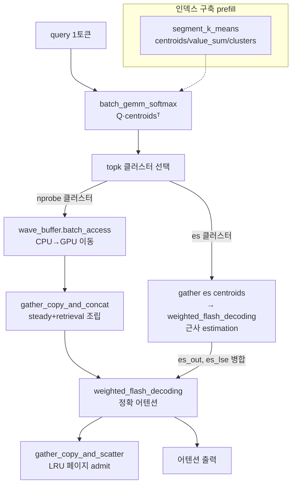

# `cache_hub/retroinfer_cache.py` 분석

## 개요
RetroInfer의 **핵심 구현체** — KV 캐시를 검색 가능한 **벡터 저장소(vector storage)** 로 재해석한 CPU 오프로드(GPU–CPU 협력) 캐시입니다. wave index(segmented k-means 클러스터링)와 wave buffer(CPU 대용량 저장 + GPU 작업 버퍼)를 결합해, 디코딩마다 관련 클러스터만 검색하여 어텐션을 계산합니다. `KV_Cache`를 상속합니다.

## 3-Zone 어텐션 모델
| Zone | 상태 | 계산 방식 |
|---|---|---|
| **steady** | `steady_zone_keys/values` (고정 토큰: sink/최근) | 항상 정확 어텐션 |
| **retrieval** | `nprobe = round(n_centroids × retrieval_budget)` 클러스터 | 검색 후 정확 어텐션 |
| **estimation** | `es_cluster_num = round(n_centroids × estimation_budget)` 클러스터 | centroid로 근사 추정(오차 경계) |

## 주요 메서드
| 메서드 | 역할 |
|---|---|
| `allocate_computation_buffer()` | GEMM/topk/estimation/execution 버퍼 사전 할당 |
| `prepare_cache()` / `_update_kv_cache()` | 인덱스 구축(`segment_k_means`)·CPU 오프로드·wave buffer 초기화 |
| `prefill_update_kv_cache(...)` | steady zone 복사 + CPU로 KV 오프로드 + 클러스터링으로 인덱스 생성 |
| `decode_update_kv_cache(...)` | 디코딩 KV 반영, 주기적 인덱스 갱신(`nprobe_new`) |
| `dense_attention(...)` | (짧은 컨텍스트 폴백) steady zone 전체에 `weighted_flash_decoding` |
| `sparse_attention(...)` | 3-zone 희소 어텐션 본체(아래 흐름) |
| `sparse_attention_with_cudagraph(...)` | 위를 CUDA Graph로 재생(오버헤드 감소) |
| `capture_cuda_graph()` | topk/estimation/attention/update 단계를 그래프로 캡처 |

## `sparse_attention` 핵심 흐름
1. `batch_gemm_softmax`로 Softmax(Q·Cᵀ) 계산 → 클러스터별 관련도 `dist`.
2. 빈 클러스터 마스킹 후 `topk`로 상위 `max_compute_cluster_num`(=nprobe+es) 선택, 상위 `nprobe`를 CPU pin 메모리로 복사.
3. **estimation**: `gather_copy_vectors`로 es 클러스터의 centroid/value_sum 수집 → `weighted_flash_decoding`으로 근사 출력(`es_out`, `es_lse`).
4. **wave buffer 접근**: `batch_access()`로 CPU→GPU 이동 작업을 스레드풀에 제출.
5. `gather_copy_and_concat`으로 steady+retrieval KV를 execution buffer에 조립.
6. **retrieval+steady**: `weighted_flash_decoding`으로 정확 어텐션, estimation 결과를 online-softmax로 병합.
7. `gather_copy_and_scatter`로 사용한 페이지를 GPU 블록 캐시에 admit(LRU 갱신).

## 블록 다이어그램

## 의존성 · 주의
- `retroinfer_kernels`(WaveBufferCPU, gather_copy_*, batch_gemm_softmax), `weighted_flash_decoding`, `kmeans.segment_k_means`에 의존.
- CUDA/Ampere Tensor Core 커널 사용 → **Ampere(sm_80+) GPU 필요**.
- `attn_func`는 상태에 따라 `dense_attention`↔`sparse_attention`(또는 CUDA Graph 버전)으로 동적 전환됩니다.
