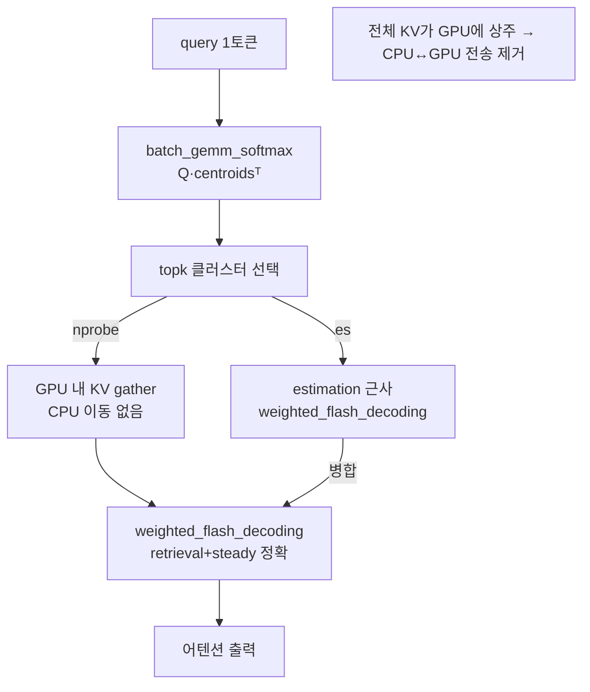

# `cache_hub/retroinfer_cache_gpu.py` 분석

## 개요
RetroInfer의 **GPU 전용(`--gpu_only`) 변형** 캐시입니다. `retroinfer_cache`와 동일한 wave index/3-zone 어텐션 개념을 쓰지만, 전체 KV 캐시를 CPU로 오프로드하지 않고 **GPU 메모리에 상주**시켜 CPU↔GPU 전송을 제거합니다. wave buffer의 CPU 협력 로직이 빠져 더 단순하고, 메모리가 충분한 경우 더 빠릅니다. `KV_Cache`를 상속합니다.

## `retroinfer_cache`(CPU 오프로드)와의 차이
| 항목 | `retroinfer_cache` | `retroinfer_cache_gpu` |
|---|---|---|
| KV 저장 위치 | CPU 대용량 + GPU 작업 버퍼 | 전량 GPU |
| wave buffer(CPU) | 사용(WaveBufferCPU, 스레드풀) | 미사용 |
| prefill 시 KV import | `flash_attn_with_kvcache` + `weighted_flash_decoding` | 동일(파일 상단 import) |
| 적합 상황 | 초장문·대배치(메모리 절약) | 컨텍스트가 GPU에 다 올라갈 때 |

## 주요 메서드
| 메서드 | 역할 |
|---|---|
| `pre_allocate_decision()` / `allocate_computation_buffer()` | GPU 버퍼 결정·할당 |
| `prepare_cache()` / `_update_kv_cache()` | 인덱스(`segment_k_means`) 구축, GPU에 유지 |
| `prefill_update_kv_cache(...)` | steady zone + 전체 KV를 GPU에 기록 |
| `decode_update_kv_cache(...)` | 디코딩 KV 반영 및 인덱스 갱신 |
| `dense_attention(...)` | 짧은 컨텍스트 폴백 |
| `sparse_attention_gpu(...)` | GPU 상주 KV에 대한 3-zone 희소 어텐션 |
| `capture_cuda_graph()` | 희소 어텐션 단계를 CUDA Graph로 캡처 |

## 블록 다이어그램

## 의존성 · 주의
- `flash_attn`(`flash_attn_with_kvcache`), `weighted_flash_decoding`, `retroinfer_kernels`, `kmeans`에 의존.
- 전량 GPU 상주이므로 **더 큰 GPU 메모리**가 필요. Ampere(sm_80+) GPU 요구는 동일.
