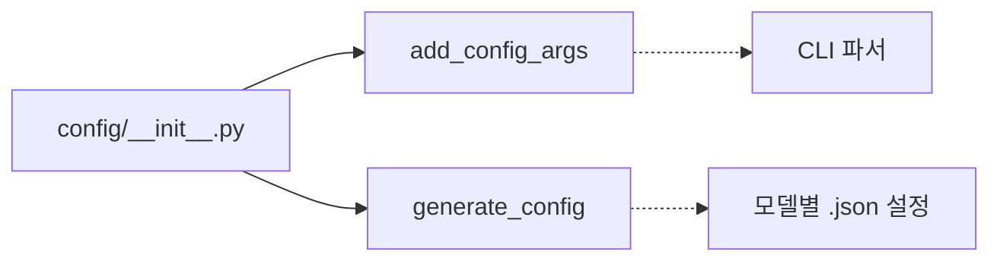

# `config/__init__.py` 분석

## 개요
`config` 패키지의 export 관문입니다. 설정 관련 두 함수를 노출합니다.

## export 대상
| 심볼 | 역할 |
|---|---|
| `add_config_args` | argparse 파서에 어텐션/희소성 관련 CLI 인자 추가 |
| `generate_config` | 모델별 JSON 설정 + 컨텍스트 길이 기반 파생값으로 최종 실행 설정 dict 생성 |

## 블록 다이어그램

## 주의
실제 로직은 `config/config.py`에 있으며, 모델별 하이퍼파라미터는 `config/<model>.json`에 저장됩니다.
