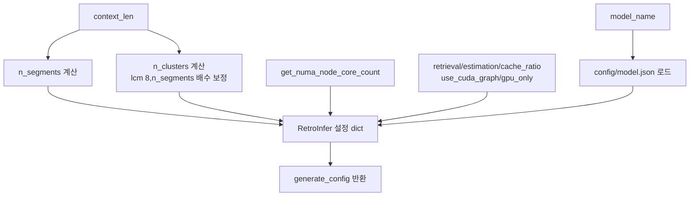

# `config/config.py` 분석

## 개요
RetroInfer 실행에 필요한 **설정을 조립하는 모듈**입니다. 모델별 정적 JSON(`config/<model>.json`)을 읽고, 입력 컨텍스트 길이에 맞춰 클러스터 수·세그먼트 수·페이지 크기 등 파생 하이퍼파라미터를 계산해 최종 설정 dict를 만듭니다. 또한 NUMA 노드의 CPU 코어 수를 조회해 wave buffer의 스레드풀 크기를 정합니다.

## 함수
| 함수 | 역할 |
|---|---|
| `add_config_args(parser)` | `--attn_type`, `--retrieval_budget`, `--estimation_budget`, `--cache_ratio`, `--use_cuda_graph`, `--gpu_only` 인자 추가 |
| `get_numa_node_core_count(node_id)` | `/sys/.../cpulist`로 NUMA 코어 수 계산(2코어는 시스템 예약) |
| `generate_config(...)` | 모델 JSON + 컨텍스트 길이로 최종 RetroInfer 설정 생성 |

## `generate_config` 핵심 계산
- `n_segments = max(round(context_len/8192), 1)` — 컨텍스트 길이 비례 세그먼트 수.
- `n_clusters ≈ context_len/16`(평균 클러스터 크기 16)이되, 커널 제약상 **lcm(8, n_segments)의 배수**로 반올림.
- `pages_per_cluster = round(16/8) = 2`(기본 페이지 = 8 벡터).
- `retrieval_budget`/`estimation_budget`/`cache_ratio`, `use_cuda_graph`, `gpu_only`를 설정에 주입.
- 짧은 컨텍스트(≤4096)는 `buffer_cluster_num`을 150으로 늘림.

## 블록 다이어그램

## 주의
- `Full_Flash_Attn`일 때는 파생 설정을 채우지 않고 원본 JSON을 그대로 반환.
- 커널 제약(클러스터 수가 lcm(8, n_segment)의 배수여야 함)을 이 단계에서 보정하므로, 이 로직을 우회하면 `retroinfer_cache`의 assert가 실패할 수 있습니다.
