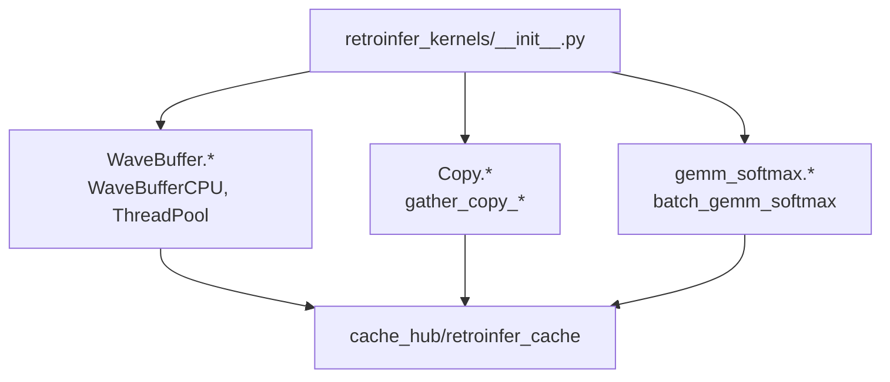

# `library/retroinfer/retroinfer_kernels/__init__.py` 분석

## 개요
컴파일된 세 확장 모듈의 심볼을 한 네임스페이스로 노출하는 **패키지 관문**입니다. Python 코드는 `from retroinfer_kernels import ...`로 CUDA/C++ 커널을 직접 호출합니다.

## 노출 심볼(주요)
| 출처 모듈 | 대표 심볼 |
|---|---|
| `WaveBuffer` | `WaveBufferCPU`, `ThreadPool` |
| `Copy` | `gather_copy_and_concat`, `gather_copy_and_scatter`, `gather_copy_vectors`, `reorganize_vectors`, `gather_copy_cluster_and_concat_fuse` |
| `gemm_softmax` | `batch_gemm_softmax` |

## 블록 다이어그램

## 주의
- 컴파일된 `.so`(setup.py 빌드 산출물)가 있어야 import 가능. 미빌드 시 `cache_hub/retroinfer_cache.py` import가 실패합니다.
