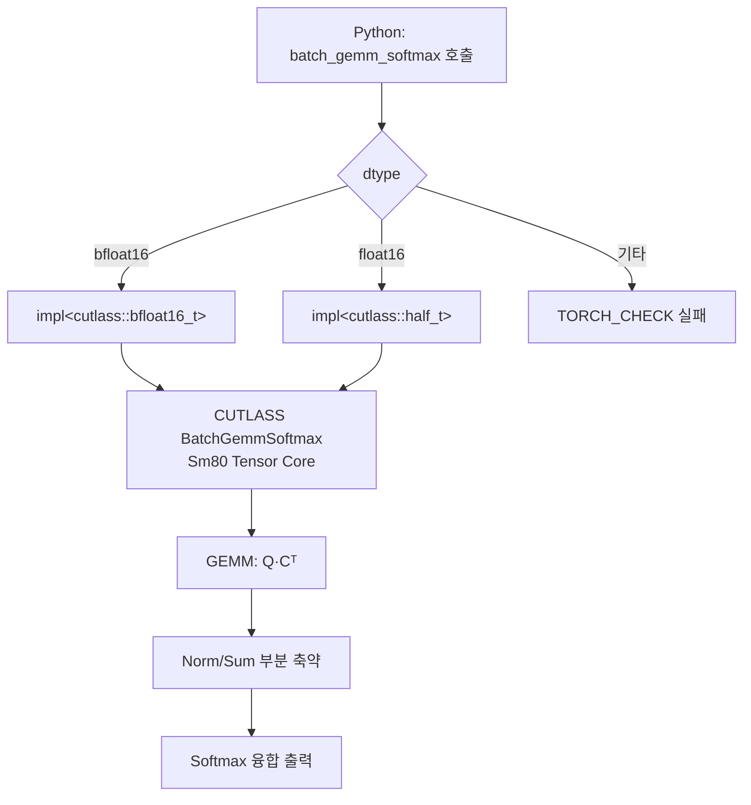

# `library/retroinfer/retroinfer_kernels/src/batch_gemm_softmax.cu` 분석

## 개요
RetroInfer의 핵심 CUDA 커널 **`batch_gemm_softmax`의 호스트 측 구현 + PyBind11 바인딩**입니다. Query와 클러스터 centroid 사이의 배치 GEMM(Q·Cᵀ)과 그 결과에 대한 Softmax를 **CUTLASS로 융합(fused)** 실행합니다. 이 커널이 `retroinfer_cache.sparse_attention`에서 클러스터 관련도(dist)를 계산하는 데 쓰입니다.

## 주요 구성 요소
| 구성 | 역할 |
|---|---|
| `batch_gemm_softmax_impl<T>` | CUTLASS `BatchGemmSoftmax` 타입을 구성하고 인자를 채워 실제 실행하는 템플릿 |
| `batch_gemm_softmax(...)` | dtype(bf16/fp16)에 따라 `impl<T>`로 디스패치하는 공개 함수 |
| `PYBIND11_MODULE` | Python에 `batch_gemm_softmax` 심볼 노출 |

## CUTLASS 커널 구성 (핵심)
| 파라미터 | 값 | 의미 |
|---|---|---|
| `ThreadblockShape` | `<32, 256, 32>` | 스레드블록 타일 크기 |
| `WarpShape` | `<32, 64, 32>` | 워프 타일 |
| `InstructionShape` | `<16, 8, 16>` | **Tensor Core MMA 명령** (Ampere) |
| `OperatorClass` | `OpClassTensorOp` | Tensor Core 사용 |
| `ArchTag` | `Sm80` | **Ampere 아키텍처 타깃** |
| `EpilogueFunctorOp` | LinearCombination (alpha 스케일) | GEMM 후처리 |
| Norm/Sum | float | Softmax 안정화용 max·합 |

- 입력 A(row-major, 쿼리), B(col-major, centroid) → D(GEMM 결과), Norm/Sum(부분 축약), Softmax(최종 출력).
- `alpha`로 스케일(보통 1/√dim), 실행은 현재 CUDA 스트림에서.

## 블록 다이어그램

## 의존성 · 주의
- **CUTLASS** 헤더(`cutlass/...`)와 `batch_gemm_softmax.h`(커널 템플릿)에 의존. CUDA 12 + `helper.h` 필요.
- `InstructionShape<16,8,16>` + `OpClassTensorOp` + `Sm80` → **Ampere(sm_80+) Tensor Core 전용**. Pascal(P6000) 등 구형 GPU에서는 컴파일/실행 불가.
- 지원 dtype: **bf16, fp16** 만(fp32 미지원).
