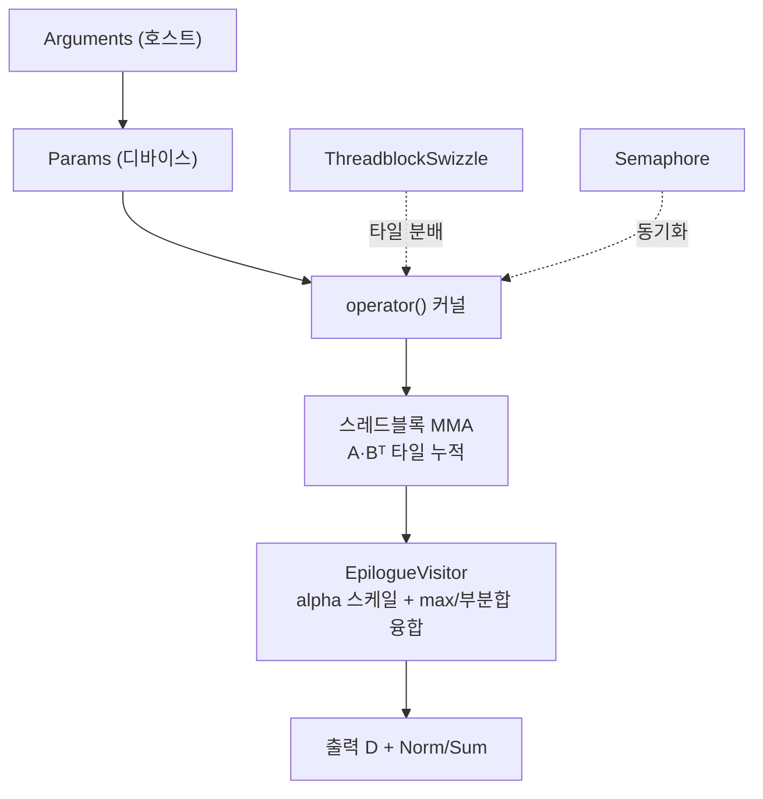

# `library/retroinfer/retroinfer_kernels/src/batch_gemm_with_epilogue_visitor.h` 분석

## 개요
`batch_gemm_softmax.h`가 사용하는 **CUTLASS GEMM 커널 구조체 `BatchGemmWithEpilogueVisitor` 정의 헤더**입니다(NVIDIA CUTLASS 파생). 표준 배치 GEMM에 **epilogue visitor 모델**을 결합해, GEMM 출력이 나오는 즉시 Softmax 부분 축약(partial reduction)을 융합(fuse)합니다. 즉, GEMM 결과를 전역 메모리로 내보내지 않고 곧바로 후처리하여 대역폭을 절약합니다.

## 주요 구성 요소
| 구성 | 역할 |
|---|---|
| `BatchGemmWithEpilogueVisitor<Mma, Epilogue, ThreadblockSwizzle>` | 커널 템플릿(스레드블록 MMA + epilogue visitor + swizzle) |
| `Arguments` | 호스트 인자: mode(GemmUniversalMode), problem_size, batch_count, A/B/C/D 참조, epilogue_visitor 인자 |
| `Params` | 디바이스 파라미터: 이터레이터 params(A/B/C/D), epilogue_visitor params, semaphore 등 |
| `SharedStorage` | 스레드블록 공유 메모리 레이아웃 |
| `operator()(Params, SharedStorage)` | 실제 디바이스 커널 본체(GEMM 메인루프 → epilogue visitor 호출) |
| `can_implement(Arguments)` | 인자 유효성/구현 가능성 검사 |

## 동작 개념
1. 스레드블록이 A·Bᵀ의 타일을 MMA(Tensor Core)로 누적.
2. 타일 완료 시 **epilogue visitor**가 결과에 접근해 alpha 스케일 + 행별 max/부분합 계산을 융합 수행.
3. 배치(batch_count)와 threadblock swizzle로 병렬 타일을 분배, semaphore로 필요한 동기화 처리.

## 블록 다이어그램

## 의존성 · 주의
- CUTLASS 헤더(`cutlass/gemm/gemm.h`, `semaphore.h`, `fast_math.h` 등)에 의존. `batch_gemm_softmax.h`의 `ApplySoftmax`와 짝을 이뤄 융합 Softmax를 구성.
- Ampere(Sm80) Tensor Core MMA를 사용하는 상위 인스턴스화에 편입됨 → **Ampere GPU 전용**.
- epilogue fusion으로 GEMM 결과의 별도 저장/재로드를 피해 메모리 트래픽을 줄이는 것이 핵심 이점입니다.
