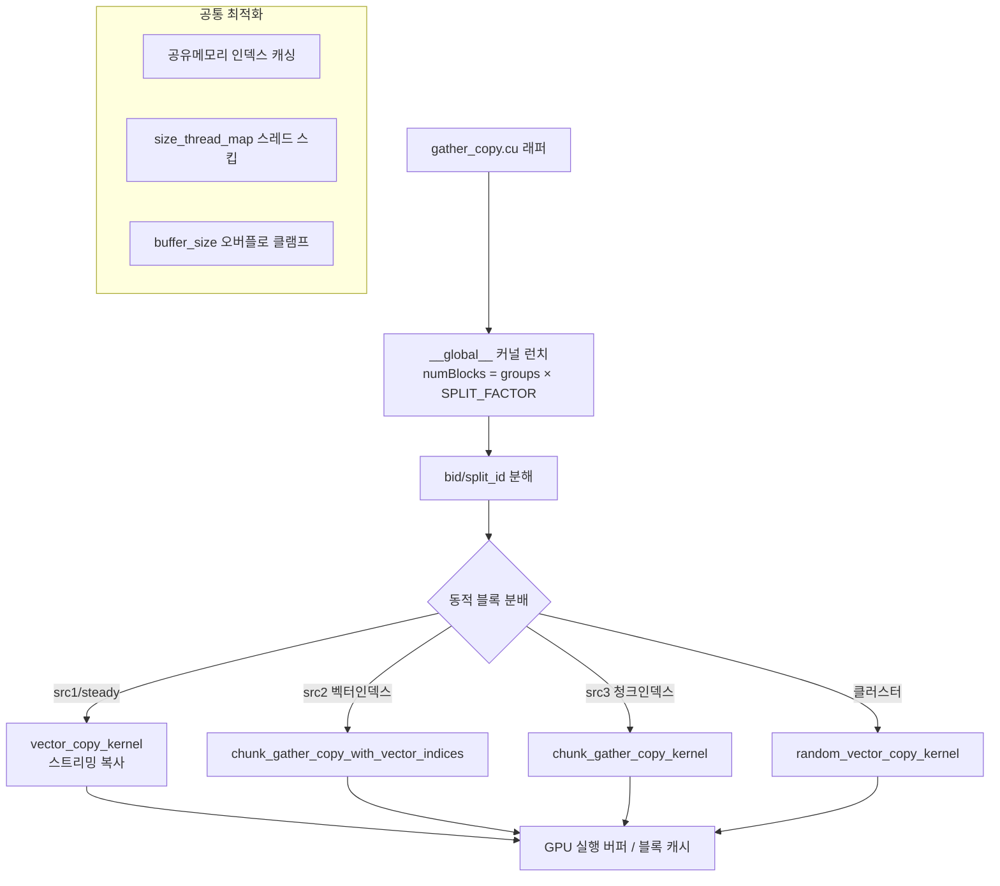

# `library/retroinfer/retroinfer_kernels/src/copy_kernel.cuh` 분석

## 개요
RetroInfer wave buffer 데이터 이동의 **실제 CUDA 커널 구현 헤더**입니다. `gather_copy.cu`의 호스트 래퍼가 호출하는 `__global__` 커널과, 그 안에서 재사용되는 `__device__` 복사 헬퍼들을 정의합니다. 벡터/청크/클러스터 단위의 gather·scatter·concat·재배치를 벡터화(`PTYPE`) 메모리 접근과 동적 블록 분배로 고성능 처리합니다.

## 컴파일타임 매크로
| 매크로 | 정의 | 의미 |
|---|---|---|
| `CHUNK_DATA_SIZE` | `CHUNK_SIZE*128*DATA_BYTES` | 한 청크(8벡터×dim128)의 바이트 수 |
| `BLOCK_SIZE_CP` | `CHUNK_DATA_SIZE/sizeof(PTYPE)` | 스레드블록 크기(청크 하나를 담당) |
| `VECTOR_SIZE_CP` | `128*DATA_BYTES/sizeof(PTYPE)` | 벡터 하나의 PTYPE 원소 수(예: 32) |
| `SPLIT_FACTOR` | 16 | 한 그룹을 처리하는 CUDA 블록 수 |

## `__device__` 헬퍼
| 함수 | 역할 |
|---|---|
| `random_vector_copy_kernel` | 임의 인덱스 벡터들을 연속 목적지로 복사 |
| `vector_copy_kernel` | 연속 구간 벡터를 그대로 복사(스트리밍) |
| `chunk_gather_copy_kernel` | 청크 인덱스 기반 복사(청크당 부분 벡터, `size_thread_map`으로 스레드 스킵) |
| `chunk_gather_copy_with_vector_indices_kernel` | 위와 같으나 src가 벡터 단위 인덱스 |
| `gather_copy_scatter_kernel` | src에서 벡터 gather → dst에 청크 단위 scatter |

## `__global__` 커널 (호스트 래퍼와 1:1)
| 커널 | 대응 래퍼(gather_copy.cu) | 동작 |
|---|---|---|
| `random_gather_copy_vector` | `gather_copy_vectors` | 인덱스 벡터+metadata를 버퍼로 gather |
| `concat_gather_copy` | `gather_copy_and_concat` | 3개 소스(steady/GPU/CPU)를 실행 버퍼로 연결 |
| `gather_copy_scatter` | `gather_copy_and_scatter` | 실행 버퍼 → GPU 블록 캐시 admit |
| `gather_copy_append` | `reorganize_vectors` | 벡터를 클러스터 단위로 목적지에 append |
| `concat_gather_copy_clusters_fuse` | `gather_copy_cluster_and_concat_fuse` | steady 스트리밍 + 클러스터 gather 융합 |

## 핵심 설계 기법
- **그룹당 SPLIT_FACTOR 블록**: `bid = blockIdx.x / SPLIT_FACTOR`, `split_id = blockIdx.x % SPLIT_FACTOR`로 한 그룹의 복사를 16개 블록이 분담.
- **동적 블록 분배**: `concat_gather_copy`·`_clusters_fuse`는 소스별 복사량(chunk/vector 수)에 비례해 `BLOCKS_2`/`BLOCKS_1`을 런타임 계산 → 부하 균형.
- **`size_thread_map`**: 청크당 복사 벡터 수(0~CHUNK_SIZE)에 따라 활성 스레드 수를 매핑, 부분 청크에서 불필요 스레드 스킵.
- **공유 메모리 인덱스 캐싱**: src/dst 오프셋·복사 크기를 SM에 적재 후 `__syncthreads()`.
- **버퍼 오버플로 보호**: `_clusters_fuse`는 `buffer_size` 초과분을 잘라 복사하고 `valid_vector_num` 기록. prefix-sum으로 dst 시작 위치 계산.
- **int64 인덱싱**: `bid`를 int64로 캐스팅해 대규모 오프셋 오버플로 방지.

## 블록 다이어그램

## 의존성 · 주의
- `gather_copy.cu`에서 `#include`되며, 그 파일이 정의한 `PTYPE`(int2)·`DATA_BYTES`·`CHUNK_SIZE` 매크로에 의존(단독 컴파일 불가).
- head_dim=128, CHUNK_SIZE=8을 전제로 상수가 하드코딩됨. CUDA GPU 필요(범용 CUDA core 사용, Tensor Core는 아님 — 순수 메모리 이동 커널).
- 이 커널들은 `retroinfer_cache.sparse_attention`의 KV 조립/admit 경로에서 실행됩니다.
