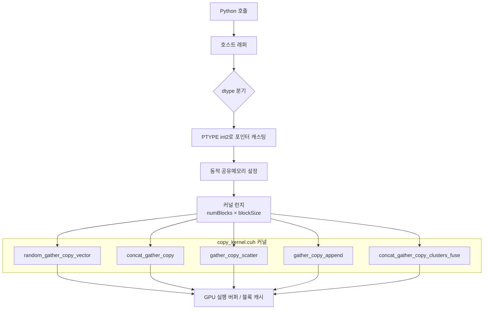

# `library/retroinfer/retroinfer_kernels/src/gather_copy.cu` 분석

## 개요
RetroInfer **wave buffer의 데이터 이동 CUDA 커널들의 호스트 래퍼 + PyBind11 바인딩**입니다. steady/retrieval/estimation 존의 KV 벡터를 GPU 실행 버퍼로 모으고(gather), 흩뿌리고(scatter), 클러스터 단위로 재배치(reorganize)하는 5개의 연산을 제공합니다. `retroinfer_cache.sparse_attention`의 KV 조립·admit 단계에서 사용됩니다.

## 공개 함수 (5개)
| 함수 | 대응 커널 | 역할 |
|---|---|---|
| `gather_copy_vectors` | `random_gather_copy_vector` | 인덱스로 지정한 벡터(+metadata)를 버퍼로 gather |
| `gather_copy_and_concat` | `concat_gather_copy` | 세 소스(steady/GPU캐시/CPU)의 KV를 실행 버퍼에 연결(concat) |
| `gather_copy_and_scatter` | `gather_copy_scatter` | 실행 버퍼 → GPU 블록 캐시로 페이지 admit(산개 복사) |
| `reorganize_vectors` | `gather_copy_append` | 벡터를 클러스터 단위로 목적지에 재배치 |
| `gather_copy_cluster_and_concat_fuse` | `concat_gather_copy_clusters_fuse` | 스트리밍 복사 + 클러스터 복사를 융합해 concat |

## 공통 설계
- **벡터화 메모리 접근**: 데이터 포인터를 `PTYPE`(=`int2`, 8바이트)로 reinterpret해 합체(coalesced) 복사. `#define`으로 `DATA_BYTES`(2=bf16/fp16, 4=fp32), `CHUNK_SIZE=8`(청크당 벡터 수) 설정.
- **dtype 분기**: 런타임에 `torch::kFloat16`/`kBFloat16`(또는 컴파일타임 fp32)로 포인터 캐스팅.
- **동적 공유 메모리**: `cudaFuncSetAttribute(..., MaxDynamicSharedMemorySize, maxSMBytes)`로 오프셋/인덱스 테이블을 SM에 적재.
- **그리드**: `numBlocks = groups × SPLIT_FACTOR`(일부는 groups), `blockSize = BLOCK_SIZE_CP`. 현재 CUDA 스트림에서 실행.
- 실제 `__global__` 커널은 `copy_kernel.cuh`에 정의(이 파일은 호스트 런처).

## 블록 다이어그램

## 의존성 · 주의
- `copy_kernel.cuh`(실제 커널), `cuda_bf16.h`/`cuda_fp16.h`, ATen/CUDAContext에 의존. CUDA GPU 필요.
- 기본 `DATA_BYTES=2`(bf16/fp16, `PTYPE=int2`). fp32는 `#define`을 바꿔야 활성화.
- 차원 128 가정(예: `data_length*128`)이 코드에 하드코딩되어 있어, head_dim=128 기준으로 설계되었습니다.
