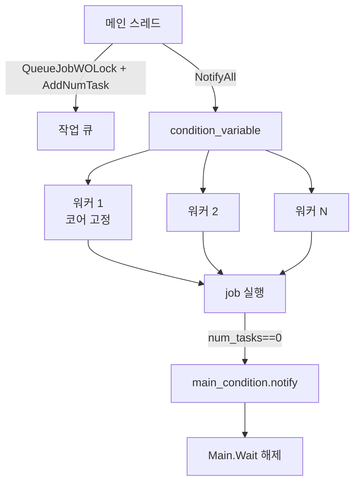

# `library/retroinfer/retroinfer_kernels/src/thread_pool.hpp` 분석

## 개요
wave buffer의 CPU 측 병렬 작업을 처리하는 **경량 스레드 풀(`MyThreadPool`) 구현 헤더**입니다. 여러 레이어에 걸쳐 재사용되며, KV 인덱스 구축·갱신·캐시 접근 같은 배치 작업을 워커 스레드에 분산합니다. 각 워커는 특정 CPU 코어에 고정(affinity)되어 NUMA 지역성을 확보합니다.

## 주요 구성 요소
| 구성 | 역할 |
|---|---|
| `set_affinity(idx)` | 호출 스레드를 CPU 코어 `idx`에 고정(`sched_setaffinity`) |
| `MyThreadPool::Start(n)` | n개(0이면 하드웨어 스레드 수) 워커 생성 |
| `QueueJobWOLock(job, para)` | (락 없이) 작업 큐에 `(함수, 인자)` 추가 |
| `AddNumTask` / `NotifyAll` / `NotifyOne` | 미완료 작업 수 증가, 워커 깨우기 |
| `Wait()` | 모든 제출 작업이 끝날 때까지 메인 스레드 대기 |
| `LockQueue`/`UnlockQueue` | 큐 뮤텍스 수동 제어 |
| `Stop()` | 종료 플래그 설정 후 모든 워커 join |
| `ThreadLoop(id)`(private) | 워커 루프: 코어 고정 → 작업 대기/실행 → 마지막 작업 완료 시 메인 통지 |

## 동기화 설계
- `queue_mutex` + `mutex_condition`: 작업 큐 보호 및 워커 대기.
- `main_mutex` + `main_condition`: 메인 스레드가 `Wait()`에서 대기, 마지막 작업 완료 시 통지.
- `std::atomic<int> num_tasks`: 미완료 작업 수 카운트(`fetch_sub`가 1 반환 시 메인 깨움).

## 블록 다이어그램

## 의존성 · 주의
- POSIX `sched.h`(affinity), `<thread>`, `<mutex>`, `<condition_variable>`에 의존. **CPU 전용**(GPU 무관).
- `wave_buffer_cpu.cpp`가 이 풀을 감싸 사용합니다. 풀은 레이어 간 재사용을 전제로 설계되었습니다.
