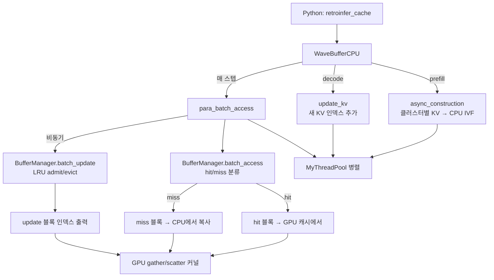

# `library/retroinfer/retroinfer_kernels/src/wave_buffer_cpu.cpp` 분석

## 개요
RetroInfer **wave buffer의 CPU 측 핵심 구현**입니다. KV 캐시를 CPU 대용량 저장소에 클러스터(IVF) 형태로 조직하고, GPU 블록 캐시에 대한 **LRU 관리(hit/miss 판정, admit/evict)** 를 수행합니다. 인덱스 구축·갱신·접근을 스레드 풀로 병렬화하며, 결과(hit/miss/update 블록 인덱스)를 PyTorch 텐서로 노출해 GPU gather/scatter 커널이 소비하게 합니다. PyBind11로 `WaveBufferCPU`/`ThreadPool`/`MyThreadPool`을 Python에 바인딩합니다.

## 주요 클래스
| 클래스 | 역할 |
|---|---|
| `ThreadPool` | `MyThreadPool`(thread_pool.hpp)의 RAII 래퍼(Python 노출용) |
| `ClusterDescriptor` | 클러스터 하나의 메타: 캐시 여부, GPU 블록 ID 배열, CPU 시작 인덱스, 블록 수, 마지막 블록 크기, LRU 리스트 포인터 |
| `BufferManager` | 그룹별 **LRU 블록 캐시 관리자** (`batch_access`로 hit/miss 산출, `batch_update`로 admit/evict) |
| `WaveBufferCPU` | 전체 오케스트레이터: 인덱스 구축/갱신, 병렬 접근, 텐서 I/O 바인딩 |

## `BufferManager` 핵심 (LRU)
- `batch_access(keys, ...)`: 검색된 클러스터를 순회하며 **hit**(GPU 캐시 존재)/**miss**(CPU에서 복사 필요)로 분류, 각 블록의 ID·크기·누적합을 출력. `max_consider_block` 초과 시 경고 후 중단.
- `batch_update(...)`: hit 키의 LRU 순서 갱신 + miss 키 중 용량 내에서 admit 가능한 만큼 선정 → `removeLeastRecentlyUsed()`로 공간 확보 후 GPU 블록 할당.
- `free_block_ids`(빈 블록 집합) + `lru_keys`(사용 순서 리스트)로 관리.

## `WaveBufferCPU` 주요 메서드
| 메서드 | 역할 |
|---|---|
| `set_indices` / `set_kv` | 출력 인덱스·KV 텐서 포인터 바인딩(fp16/bf16 → uint16 재해석) |
| `async_construction` / `para_construct` / `construct_func` | prefill 시 클러스터별로 KV를 CPU IVF 배열에 재조직(병렬) |
| `update_kv` / `update_kv_func` | 디코딩 중 새 KV를 인덱스에 추가(병렬) |
| `para_batch_access` → `batch_access` → `para_batch_updata` → `batch_update` | 접근(hit/miss) 후 비동기 캐시 갱신 제출 |
| `sync` / `construction_sync` | 스레드 풀 작업 완료 대기 |

## 블록 다이어그램

## 의존성 · 주의
- `thread_pool.hpp`, `pybind11`, `torch/extension.h`, OpenMP에 의존. **CPU 전용**(GPU 커널이 아닌, GPU-CPU 협력의 CPU 절반).
- KV는 `uint16_t`로 취급(bf16/fp16 공통, dim×2바이트). 클러스터당 GPU 블록 ID는 `PRE_ALLOCATED_NUM=4`만큼 사전 할당 후 필요 시 확장.
- 검색 페이지가 `buffer_size`(max_consider_block)를 넘으면 경고하며 남은 클러스터를 건너뜁니다 → `buffer_cluster_num`을 늘려 해결.
- 이 파일이 `retroinfer_cache.py`의 `WaveBufferCPU`/`ThreadPool` 실체이며, GPU 측 커널(`copy_kernel.cuh`)과 짝을 이룹니다.
