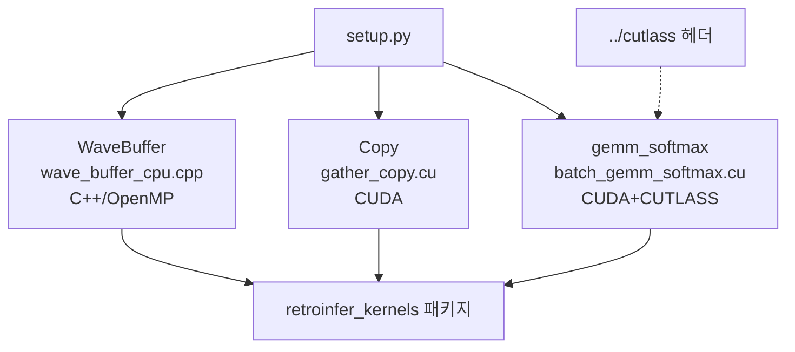

# `library/retroinfer/setup.py` 분석

## 개요
RetroInfer의 **커스텀 C++/CUDA 커널(`retroinfer_kernels`)을 빌드·설치하는 setuptools 스크립트**입니다. 세 개의 확장 모듈을 컴파일하며, CUDA GEMM+Softmax 커널은 NVIDIA CUTLASS 헤더에 의존합니다.

## 빌드되는 확장 모듈
| 모듈 | 소스 | 종류 | 역할 |
|---|---|---|---|
| `retroinfer_kernels.WaveBuffer` | `wave_buffer_cpu.cpp` | C++ (OpenMP) | wave buffer의 CPU 측 KV 저장/이동 관리 |
| `retroinfer_kernels.Copy` | `gather_copy.cu` | CUDA | gather/scatter/concat 데이터 이동 커널 |
| `retroinfer_kernels.gemm_softmax` | `batch_gemm_softmax.cu` | CUDA + CUTLASS | Q·centroidsᵀ GEMM + 융합 Softmax |

## 핵심 설정
- CUTLASS 헤더 경로를 `../cutlass`로 지정(사전에 `git clone`한 CUTLASS 필요).
- 컴파일 옵션: `-O3 -std=c++17 --expt-relaxed-constexpr`, OpenMP(`-fopenmp`), `-lcuda -lcudart`.
- `BuildExtension`(torch.utils.cpp_extension)으로 빌드.

## 블록 다이어그램

## 의존성 · 주의
- 빌드 전 `git clone https://github.com/NVIDIA/cutlass.git` 필요(README의 커널 설치 단계).
- GEMM 커널은 CUTLASS `Sm80`(Ampere Tensor Core) 타깃 → **Ampere GPU에서만 빌드/실행** 가능.
- CUDA 12 헤더 경로(`/usr/local/cuda-12/include`)를 참조.
