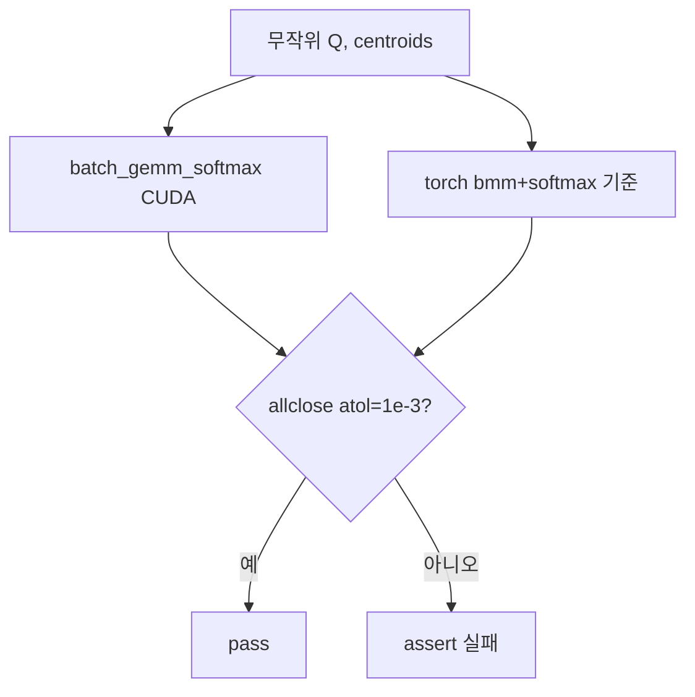

# `library/retroinfer/test/test_batch_gemm_softmax.py` 분석

## 개요
커스텀 CUDA 커널 `batch_gemm_softmax`의 **정확성·성능을 검증하는 단위 테스트**입니다. 커널 출력과 순수 PyTorch 기준 구현(bmm + softmax)을 비교합니다.

## 검증 대상
`batch_gemm_softmax(queries, centroids, ...)` = Softmax(Q·Cᵀ / √dim)
- Q: `(batch×group_num, group_size, dim)` — 쿼리 벡터
- C: `(batch×group_num, n_clusters, dim)` — centroid 벡터
- 출력: `(batch×group_num, group_size, n_clusters)` — 클러스터별 관련도(softmax)

## 테스트 로직
| 단계 | 내용 |
|---|---|
| 준비 | 무작위 Q/C 및 gemm_o/softmax_o/_norm/_sum 버퍼 생성 (n_clusters=8200, 8의 배수) |
| 실행 | CUDA 커널 호출 후 시간 측정 |
| 기준 | `torch_batch_gemm_softmax`(bmm→/√dim→softmax) |
| 비교 | `torch.allclose(..., atol=1e-3)`로 정확성 확인 |

## 블록 다이어그램

## 주의
- CUDA GPU + 빌드된 `retroinfer_kernels` 필요. dtype은 `bfloat16`.
- `n_clusters`는 커널 제약상 8의 배수여야 함(주석 명시).
