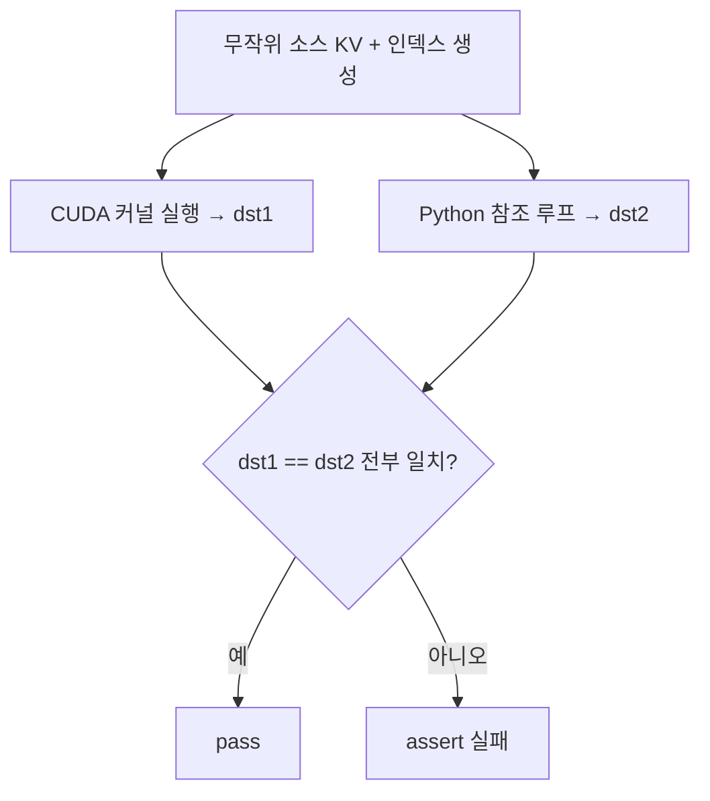

# `library/retroinfer/test/test_gather_copy.py` 분석

## 개요
wave buffer의 **데이터 이동 CUDA 커널들(gather/scatter/concat/reorganize)의 정확성을 검증하는 단위 테스트 모음**입니다. 각 커널 출력을 순수 Python 참조 루프와 요소 단위로 비교합니다.

## 검증 대상 커널
| 테스트 함수 | 커널 | 검증 내용 |
|---|---|---|
| `test_concat_gather_copy` | `gather_copy_and_concat` | steady + (GPU/CPU) 두 소스에서 KV를 execution buffer로 조립, valid_length 산출 |
| `test_gather_copy_scatter` | `gather_copy_and_scatter` | execution buffer → GPU 블록 캐시로 페이지 admit(산개 복사) |
| `test_gather_copy_vectors` | `gather_copy_vectors` | 인덱스로 지정한 벡터(및 metadata)를 버퍼로 gather |
| `test_reorganize_vectors` | `reorganize_vectors` | 클러스터 단위로 벡터를 목적지에 재배치 |
| `test_gather_copy_cluster_and_concat_fuse` | `gather_copy_cluster_and_concat_fuse` | 클러스터 gather + concat 융합, 버퍼 오버플로 처리 |

## 검증 방식
- `gen_indices`/`gen_two_indices`/`split_integer_sum`으로 경계 케이스 포함 무작위 인덱스 생성.
- CUDA 커널 실행 결과(`*_dst1`)와 Python 루프 결과(`*_dst2`)를 `(dst1 == dst2).all()`로 완전 일치 확인.

## 블록 다이어그램

## 주의
- CUDA GPU + 빌드된 `retroinfer_kernels` 필요. dtype은 `bfloat16`, 일부 소스는 CPU pinned 메모리(호스트↔디바이스 gather 검증).
- 이 커널들은 `cache_hub/retroinfer_cache.py`의 `sparse_attention` 흐름에서 실제로 사용됩니다.
