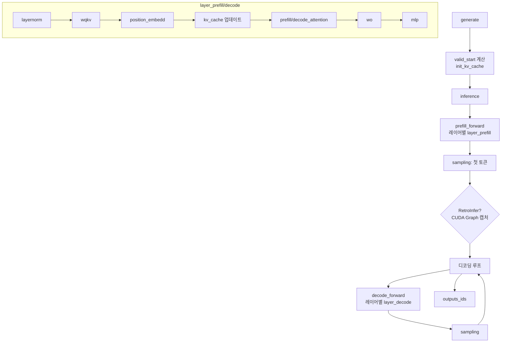

# `model_hub/LLM.py` 분석

## 개요
`LlamaModel`·`QwenModel`의 **공통 베이스 클래스 `LLM`** 으로, 추론 실행 엔진의 골격을 정의합니다. 레이어별 prefill/decode 순전파, 전체 prefill/decode forward, 샘플링, 그리고 상위 진입점 `generate`/`inference`를 제공합니다. 모델별 세부 연산(임베딩, wqkv, RoPE, layernorm, mlp 등)은 하위 클래스가 오버라이드합니다(템플릿 메서드 패턴).

## 주요 메서드
| 메서드 | 단계 | 역할 |
|---|---|---|
| `layer_prefill(...)` | Prefill | layernorm→wqkv→RoPE→KV캐시 업데이트→`prefill_attention`→wo→MLP(청크 처리) |
| `layer_decode(...)` | Decode | 1토큰에 대한 동일 파이프라인, `decode_attention` 사용 |
| `prefill_forward/decode_forward` | - | 전 레이어 순회(멀티 GPU 시 `parameter_move`) 후 최종 layernorm+lm head |
| `sampling(...)` | - | greedy(argmax) 또는 flashinfer top-k/top-p 샘플링 |
| `inference(...)` | - | prefill→(RetroInfer면 CUDA Graph 캡처)→디코딩 루프, 지연/처리량 측정 |
| `generate(...)` | - | 공개 진입점: 유효 길이 계산, 캐시 초기화(`init_kv_cache`), `inference` 호출 |

## 핵심 로직
- **valid_start**: attention_mask로 배치별 좌측 패딩 시작 위치 계산. 길이가 서로 다르면 `prefill_bsz=1`, `prefill_method=full`로 강제.
- **메모리 절약**: prefill MLP를 65536 토큰 청크로 나눠 처리(1M 컨텍스트 대응).
- **EOS 처리**: `ignore_eos=False`면 모든 시퀀스가 EOS에 도달 시 조기 종료.

## 블록 다이어그램

## 의존성 · 주의
- `flashinfer`(샘플링)에 의존. 하위 클래스가 `kv_cache`, `layers`, `word_embedding` 등 속성을 제공해야 동작.
- CUDA GPU 필요(`torch.cuda.synchronize`, 멀티 GPU 분산 지원).
