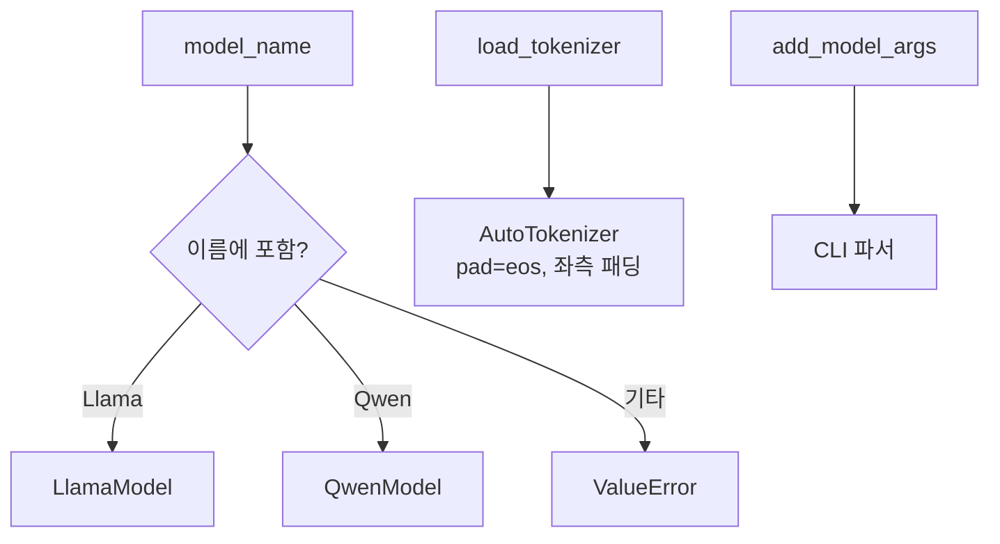

# `model_hub/__init__.py` 분석

## 개요
`model_hub` 패키지의 관문이자 **모델 팩토리**입니다. 모델 이름에 따라 `LlamaModel`/`QwenModel`을 선택해 생성하고, 토크나이저 로딩과 CLI 인자 추가 헬퍼를 제공합니다.

## 함수
| 함수 | 역할 |
|---|---|
| `add_model_args(parser)` | `--device`, `--dtype`, `--model_name` 인자 추가(지원 모델 choices 포함) |
| `load_tokenizer(model_name)` | HF 토크나이저 로드, pad_token=eos, 좌측 패딩 설정 |
| `load_model(model_name, max_len, dtype, device, tokenizer)` | 이름에 'Llama'/'Qwen' 포함 여부로 모델 클래스 분기 생성 |

## 블록 다이어그램

## 주의
- `from .llama import LlamaModel`, `from .qwen import QwenModel`를 최상단에서 import하므로, 두 파일이 최상단에서 요구하는 `flashinfer` 등 의존성이 없으면 이 패키지 import 자체가 실패합니다.
