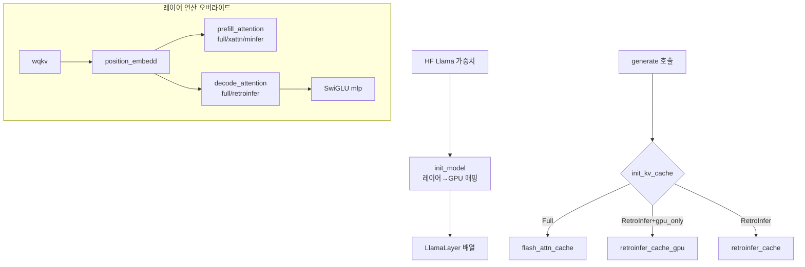

# `model_hub/llama.py` 분석

## 개요
`LLM` 베이스를 상속한 **Llama 계열 모델 구현체**입니다(Llama-3-8B-1048K, Llama-3.1-8B, DeepSeek-R1-Distill-Llama-8B 등). HuggingFace 가중치를 로드해 자체 추론 엔진용 레이어 구조로 재배치하고, RetroInfer에 필요한 KV 캐시 선택·모델별 연산(RoPE, RMSNorm, SwiGLU MLP)을 정의합니다.

## 주요 구성 요소
| 구성 | 역할 |
|---|---|
| `LlamaLayer` | 레이어별 가중치(wqkv, wo, gate_up, down, layernorm) 컨테이너, `init_layer`로 HF 가중치 이식 |
| `LlamaModel.init_model()` | HF 모델 로드, 레이어→GPU 매핑, 임베딩/lm_head/norm 세팅 |
| `init_kv_cache(...)` | `attention_type`/`gpu_only`에 따라 `flash_attn_cache`/`retroinfer_cache`/`retroinfer_cache_gpu` 선택 |
| `prefill_attention(...)` | `full`/`xattn`/`minfer` 분기 |
| `decode_attention(...)` | `Full_Flash_Attn`→`full_decode_attn`, `RetroInfer`→`retroinfer_decode_attn` |
| `wqkv`/`wo`/`mlp` | QKV projection, output projection, SwiGLU MLP |
| `apply_rotary_pos_emb`/`position_embedd`/`layernorm` | RoPE 적용, 위치 임베딩, (flashinfer)RMSNorm |
| `parameter_move(...)` | 멀티 GPU에서 레이어 경계마다 hidden_states 이동 |

## KV 캐시 선택 로직
```
Full_Flash_Attn        → flash_attn_cache
RetroInfer + gpu_only  → retroinfer_cache_gpu
RetroInfer (기본)       → retroinfer_cache (CPU 오프로드)
```

## 블록 다이어그램


## 의존성 · 주의
- `flashinfer`(RMSNorm/RoPE/SiLU), `attn_hub`, `cache_hub`에 의존 → Ampere GPU 필요.
- `minfer` 사용 시 `self.best_patterns`(minfer_patterns.py), `xattn` 사용 시 `self.thresholds`(xattn_thresholds.py) 필요.
