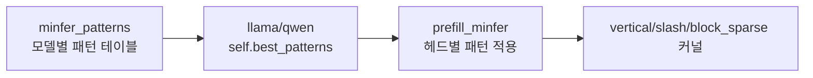

# `model_hub/minfer_patterns.py` 분석

## 개요
MInference prefill(`--prefill_method minfer`)에 사용되는 **모델·레이어·헤드별 최적 희소 패턴을 담은 데이터 모듈**입니다. 각 어텐션 헤드가 어떤 패턴(`stream_llm`, `vertical_and_slash`, `block_sparse`)과 어떤 크기(vertical/slash size)를 쓸지 사전 프로파일링 결과로 정의합니다. 코드 로직보다는 대용량 상수 테이블에 가깝습니다.

## 구조
- 모델별로 `[layer_idx][str(head_idx)] = (pattern_type, vertical_size, slash_size, ...)` 형태의 중첩 dict/리스트.
- `model_hub/llama.py`·`qwen.py`가 `minfer` 경로에서 `self.best_patterns[layer_idx]`로 조회해 `attn_hub/minfer.py`의 `prefill_minfer`에 전달.

## 블록 다이어그램

## 주의
- 순수 데이터 파일이라 별도 실행 로직이 없습니다. MInference 논문의 오프라인 검색(search) 결과를 하드코딩한 것입니다.
- `--prefill_method minfer`를 쓸 때만 참조됩니다.
