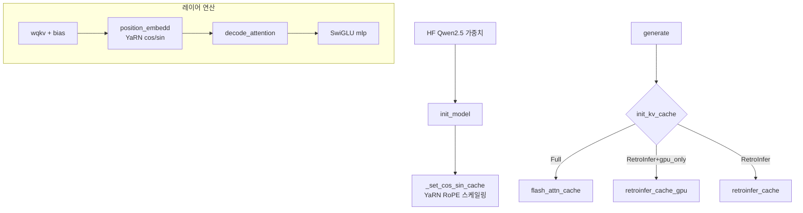

# `model_hub/qwen.py` 분석

## 개요
`LLM` 베이스를 상속한 **Qwen2.5 계열 모델 구현체**입니다(Qwen2.5-7B/72B-Instruct, DeepSeek-R1-Distill-Qwen-7B 등). 구조는 `llama.py`와 거의 대칭이며, Qwen 특유의 요소(QKV bias, YaRN 기반 RoPE 스케일링)를 추가로 처리합니다.

## `llama.py`와의 차이
| 항목 | Llama | Qwen |
|---|---|---|
| QKV bias | 없음 | 있음(`wqkv`에 bias 포함) |
| RoPE 스케일링 | 표준/선형 | **YaRN**(`find_correction_dim/range`, `linear_ramp_factor`)으로 장문 확장 |
| MLP | SwiGLU | SwiGLU(동일) |
| KV 캐시 선택 | 동일 | 동일(`flash_attn_cache`/`retroinfer_cache`/`_gpu`) |

## 주요 구성 요소
| 구성 | 역할 |
|---|---|
| `QwenLayer` / `init_layer` | 레이어 가중치(+QKV bias) 컨테이너 |
| `_set_cos_sin_cache()` | YaRN 보정으로 RoPE cos/sin 캐시 생성 |
| `init_model()` | HF Qwen 로드·레이어 매핑 |
| `init_kv_cache(...)` | `attention_type`/`gpu_only`로 캐시 선택(llama와 동일 로직) |
| `wqkv`/`wo`/`mlp`/`layernorm`/`position_embedd` | 모델별 연산 오버라이드 |

## 블록 다이어그램

## 의존성 · 주의
- `flashinfer`, `attn_hub`, `cache_hub`에 의존 → Ampere GPU 필요.
- 72B 모델은 멀티 GPU 분산(`layer_mapping`)이 필요(최소 3장, README 기준).
