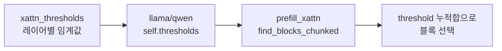

# `model_hub/xattn_thresholds.py` 분석

## 개요
XAttention prefill(`--prefill_method xattn`)에 사용되는 **모델·레이어별 블록 선택 임계값(threshold)을 담은 데이터 모듈**입니다. `attn_hub/xattn.py`의 블록 중요도 누적합 기준을 레이어별로 조정하기 위한 사전 프로파일링 상수입니다. 코드 로직보다는 상수 테이블에 가깝습니다.

## 구조
- 모델별로 `[layer_idx] = threshold(float)` 형태의 리스트/dict.
- `model_hub/llama.py`·`qwen.py`가 `xattn` 경로에서 `self.thresholds[layer_idx]`로 조회해 `attn_hub/xattn.py`의 `prefill_xattn`에 전달.

## 블록 다이어그램

## 주의
- 순수 데이터 파일입니다. 임계값이 높을수록 더 많은 블록을 유지(정확도↑, 속도↓), 낮을수록 더 공격적으로 희소화합니다.
- `--prefill_method xattn`을 쓸 때만 참조됩니다.
