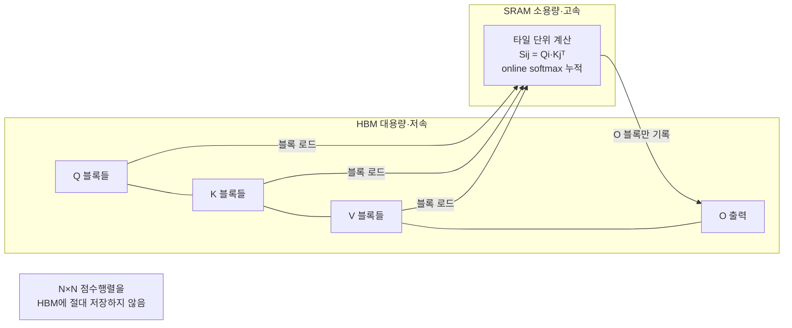
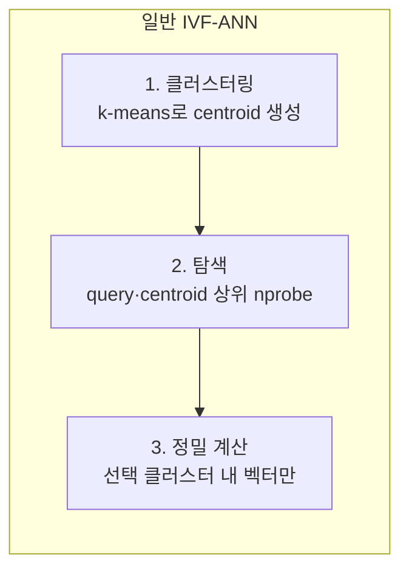
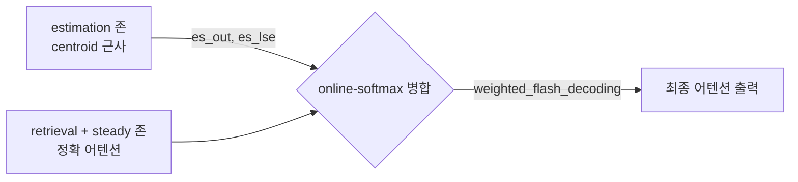
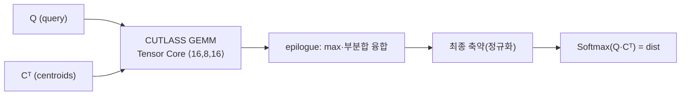
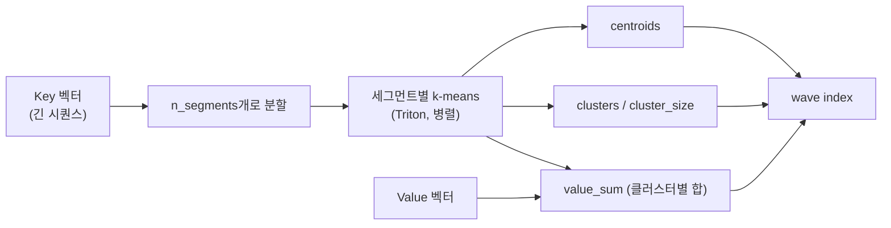
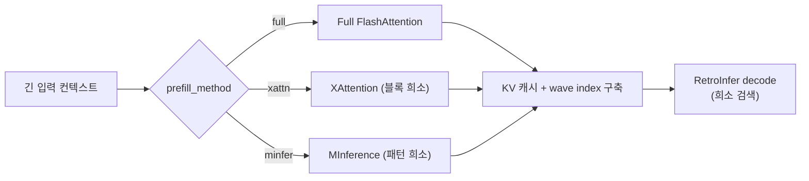

# RetroInfer 세미나 보충 노트 (Supplementary Notes)

발표 자료(`RetroInfer_세미나.pptx`)에서 언급한 개념들을 더 깊이 설명하는 노트입니다. 슬라이드는 요약이고, 이 문서는 그 배경·원리·코드 연결을 자세히 다룹니다.

## 목차
1. [FlashAttention](#1-flashattention)
2. [ANN (근사 최근접 이웃 탐색)](#2-ann-근사-최근접-이웃-탐색)
3. [online-softmax 병합](#3-online-softmax-병합)
4. [CUTLASS · Tensor Core](#4-cutlass--tensor-core)
5. [segmented k-means](#5-segmented-k-means)
6. [GQA (Grouped-Query Attention)](#6-gqa-grouped-query-attention)
7. [RoPE · YaRN](#7-rope--yarn)
8. [XAttention · MInference](#8-xattention--minference)

---

## 1. FlashAttention

> 발표 자료 연관 슬라이드: **2 (문제 정의)**, **10 (성능 비교의 기준선)**, **11 (의존성 `flash-attn 2.7.3`)**

### 1.1 왜 중요한가 — RetroInfer에서의 위치

FlashAttention은 RetroInfer 이야기에서 두 가지 역할을 합니다.

1. **성능 비교의 기준선(baseline)**: RetroInfer가 보고하는 "디코딩 처리량 4.5–10.5× 향상"은 **FlashAttention 대비** 수치입니다. 즉 FlashAttention은 "정확 어텐션의 최적화된 표준"이고, RetroInfer는 그보다 더 나아가 *희소성*까지 활용합니다.
2. **실제 실행 의존성**: RetroInfer 코드도 FlashAttention(및 그 파생 포크)을 **직접 사용**합니다.
   - Prefill: `attn_hub/full_attn.py`의 `full_prefill_attn` → `flash_attn_with_kvcache`
   - Decode(정확 존): `weighted_flash_decoding`(Starmys의 weighted flash-attention 포크)
   - 기준선 실행: `attn_type='Full_Flash_Attn'` 경로 전체

따라서 FlashAttention을 이해하면 "RetroInfer가 무엇을 이어받고, 어디서 더 나아갔는지"가 명확해집니다.

### 1.2 표준 어텐션의 진짜 병목 — 계산이 아니라 메모리 IO

셀프 어텐션의 정의는 다음과 같습니다 (Q, K, V ∈ ℝ^{N×d}, N=시퀀스 길이, d=head_dim):

```
S = Q Kᵀ / √d        # (N × N) 점수 행렬
P = softmax(S)        # 행 단위 softmax
O = P V               # (N × d) 출력
```

순진한 구현의 문제는 **중간 행렬 S, P가 N×N** 이라는 점입니다.

- **메모리**: N=128K면 S는 128K×128K → 수십 GB. 물리적으로 GPU에 올릴 수 없음.
- **속도**: 실제 병목은 FLOPs가 아니라 **HBM(고대역폭 메모리) ↔ SRAM 사이의 데이터 이동(IO)** 입니다. S, P를 HBM에 썼다가 다시 읽는 왕복이 전체 시간을 지배합니다. 즉 어텐션은 **memory-bound(메모리 바운드)** 연산입니다.

### 1.3 핵심 아이디어 — 타일링 + 온라인 소프트맥스 + 재계산

FlashAttention(Dao et al., 2022)의 통찰: **N×N 행렬을 절대 통째로 만들지 않는다.** IO를 의식하는(IO-aware) 방식으로, 블록 단위로 잘라 SRAM 안에서 처리합니다.

세 가지 기법이 결합됩니다.

1. **타일링(Tiling)**: Q, K, V를 블록으로 나눠, 한 번에 한 블록 쌍(Qᵢ, Kⱼ, Vⱼ)만 SRAM으로 올려 부분 어텐션을 계산합니다.
2. **온라인 소프트맥스(Online softmax)**: 전체 행을 보지 않고도, K/V 블록을 순회하며 **running max와 running sum을 갱신**해 정확한 softmax 결과를 누적합니다(아래 1.4).
3. **재계산(Recomputation)**: 역전파(backward) 시 거대한 P를 저장하지 않고, 저장해 둔 통계값(m, ℓ)으로 필요할 때 다시 계산합니다. 저장 공간 O(N²) → O(N).

결과: **HBM 접근이 O(N²/√M) 수준으로 감소**(M=SRAM 크기)하고, 중간 행렬을 저장하지 않아 메모리가 O(N)으로 떨어집니다. 수학적으로는 표준 어텐션과 **완전히 동일한 결과**(근사가 아님)를 냅니다.



### 1.4 온라인 소프트맥스 — 어떻게 한 번에 안 보고도 정확한가

softmax는 원래 **행 전체의 max와 합**이 필요합니다. FlashAttention은 K/V 블록을 순회하며 이를 점진적으로 갱신합니다. j번째 블록을 처리할 때:

```
mᵢ_new = max(mᵢ_old, rowmax(Sᵢⱼ))                     # running max 갱신
ℓᵢ_new = e^(mᵢ_old − mᵢ_new)·ℓᵢ_old + rowsum(e^(Sᵢⱼ − mᵢ_new))
Oᵢ_new = e^(mᵢ_old − mᵢ_new)·Oᵢ_old + e^(Sᵢⱼ − mᵢ_new)·Vⱼ
```

- `m`(running max)은 지수 폭발을 막는 **수치 안정화** 항입니다.
- 새 블록에서 더 큰 max가 나오면, 이전까지 누적한 `ℓ`과 `O`를 `e^(mᵢ_old − mᵢ_new)` 배로 **재스케일(rescale)** 해 보정합니다.
- 모든 블록을 처리한 뒤 `Oᵢ / ℓᵢ`로 정규화하면 표준 softmax 어텐션과 **정확히 같은** 결과가 됩니다.

> 이 "running max + running sum + 재스케일" 패턴은 RetroInfer에도 그대로 나타납니다. `cache_hub/retroinfer_cache.py`의 `sparse_attention`은 **estimation 존의 부분 결과(`es_out`, `es_lse`)를 retrieval/steady 존 계산에 online-softmax로 병합**하는데, 여기서 `lse`(log-sum-exp)가 바로 위의 `m`, `ℓ` 통계에 해당합니다. 즉 3-zone을 정확하게 합치는 수학이 FlashAttention의 온라인 소프트맥스와 동일한 원리입니다.

### 1.5 FlashAttention-2에서 달라진 점

RetroInfer가 고정한 버전은 `flash-attn==2.7.3`입니다. v2(Dao, 2023)는 v1 대비:

- **비-matmul 연산 감소**: 재스케일 횟수를 줄이고, Tensor Core가 잘하는 matmul 비중을 높임.
- **작업 분할(work partitioning) 개선**: 시퀀스 길이 축으로 병렬화를 강화해 SM 점유율(occupancy)을 높임.
- **워프 단위 분할 최적화**: 공유 메모리 접근·동기화 비용 절감.

결과적으로 A100에서 이론 FLOPs의 50–70%대까지 도달합니다. 다만 이 최적화는 **Ampere 이상(sm_80+)의 Tensor Core**를 전제로 합니다 → 발표 자료 슬라이드 11의 "Pascal 등 구형 GPU 불가"의 한 축입니다.

### 1.6 디코딩용 변형 — `flash_attn_with_kvcache`

학습(prefill)은 긴 Q에 대한 어텐션이지만, **자기회귀 디코딩**은 매 스텝 **Q 길이가 1**(새 토큰 1개)이고 K/V는 캐시에 누적됩니다. `flash_attn_with_kvcache`는 이 상황에 특화된 커널로:

- KV 캐시를 in-place로 유지하며 새 토큰의 K/V를 이어 붙이고,
- 길이 1 쿼리에 대해 전체 KV와 어텐션을 IO 효율적으로 계산합니다.

RetroInfer의 `attn_hub/full_attn.py`가 이를 그대로 사용합니다:

```python
# full_decode_attn: valid_len으로 캐시 유효 길이를 넘겨 1토큰 디코딩
attn_out = flash_attn_with_kvcache(q=query_states, k_cache=..., v_cache=..., cache_seqlens=valid_len)
```

### 1.7 FlashAttention의 한계 → RetroInfer의 출발점

FlashAttention은 **어텐션을 IO 효율적으로 만들었지만, 여전히 "전량 어텐션"** 입니다. 즉 디코딩 1스텝마다 **모든 과거 KV 토큰**을 읽고 계산합니다.

- 계산·메모리 접근이 컨텍스트 길이 N에 **선형(O(N))** 으로 증가.
- 128K~1M 토큰에서는 이 선형 비용조차 처리량을 크게 떨어뜨리고, KV 캐시가 GPU 메모리를 압도.

RetroInfer는 여기서 한 걸음 더 나갑니다 — **어텐션의 희소성**을 이용해 "관련 있는 소수 토큰만" 검색(retrieval)합니다. FlashAttention이 *같은 계산을 더 빠르게* 했다면, RetroInfer는 *불필요한 계산을 아예 하지 않는* 방향입니다. 그래서 정확 어텐션(FlashAttention) 대비 4.5–10.5× 처리량이 가능합니다.

| 구분 | FlashAttention | RetroInfer |
|---|---|---|
| 접근 방식 | 전량 어텐션을 IO 효율적으로 | 관련 토큰만 검색(희소) |
| 디코딩 스텝당 비용 | O(N) (모든 KV) | ≈ O(budget × N) (일부 클러스터) |
| 결과 | 표준과 정확히 동일 | 정확도 보장 근사(3-zone) |
| KV 저장 | 전부 GPU | CPU 대용량 + GPU 작업 버퍼 |
| RetroInfer 내 역할 | 기준선 + prefill/정확존 커널 | 시스템 전체 |

### 1.8 한 줄 정리

**FlashAttention** = "N×N 행렬을 만들지 않고, 타일링 + 온라인 소프트맥스로 어텐션을 IO 효율적으로 계산하는 정확 알고리즘." RetroInfer는 이 위에서 *희소 검색*을 얹어, 정확 어텐션의 표준(FlashAttention)을 처리량 기준선으로 넘어섭니다.

### 참고문헌
- Dao et al., *FlashAttention: Fast and Memory-Efficient Exact Attention with IO-Awareness*, NeurIPS 2022. [arXiv:2205.14135](https://arxiv.org/abs/2205.14135)
- Dao, *FlashAttention-2: Faster Attention with Better Parallelism and Work Partitioning*, 2023. [arXiv:2307.08691](https://arxiv.org/abs/2307.08691)
- 코드: [`attn_hub/full_attn.py`](../attn_hub/full_attn.py), [`cache_hub/retroinfer_cache.py`](../cache_hub/retroinfer_cache.py)

---

## 2. ANN (근사 최근접 이웃 탐색)

> 발표 자료 연관 슬라이드: **3 (핵심 통찰)**, **6 (Wave Index)**

**ANN = Approximate Nearest Neighbor search (근사 최근접 이웃 탐색)**. RetroInfer의 "KV 캐시를 벡터 저장 시스템으로 다룬다"는 발상의 이론적 뿌리입니다.

### 2.1 왜 어텐션이 ANN 문제인가

디코딩 한 스텝에서 어텐션이 하는 일을 다시 보면:

```
S = q · Kᵀ / √d      # 현재 query q(1개)와 모든 key의 내적
P = softmax(S)        # 큰 점수일수록 큰 가중치
O = P · V             # 가중합
```

softmax는 **점수가 큰 소수의 key에 가중치를 몰아줍니다**(지수 함수의 성질). 즉 출력 O에 실질적으로 기여하는 것은 `q`와 내적이 큰 = **q에 가장 가까운(방향이 비슷한) 소수의 key** 뿐입니다.

> "query와 내적이 큰 상위 몇 개의 벡터를 찾아라" — 이것이 정확히 **최근접 이웃 탐색(NN search)** 의 정의입니다. (내적/코사인 유사도 기준의 Maximum Inner Product Search, MIPS)

그런데 정확한 NN(모든 key와 내적)을 매번 하면 결국 전량 어텐션과 같아집니다. 그래서 **근사(Approximate)** 를 씁니다 — 약간의 누락을 감수하고 훨씬 빠르게 "충분히 좋은" 상위 후보를 찾습니다. 이것이 ANN입니다.

### 2.2 정확 NN vs 근사 ANN — 재현율/지연 트레이드오프

| | 정확 NN (brute force) | 근사 ANN |
|---|---|---|
| 방식 | 모든 벡터와 거리 계산 | 인덱스로 후보만 계산 |
| 비용 | O(N) — 느림 | O(N보다 훨씬 작음) — 빠름 |
| 정확도 | 100% | **재현율(recall) < 100%** (일부 진짜 이웃 누락 가능) |

ANN의 핵심 지표는 **재현율(recall)** = "진짜 상위 k개 중 몇 개를 실제로 찾았나". 인덱스를 더 많이 탐색할수록 recall↑·지연↑. 시스템은 이 **재현율 ↔ 지연 트레이드오프**를 조절합니다. RetroInfer에서는 `retrieval_budget`이 바로 이 조절 손잡이입니다.

### 2.3 대표적 ANN 인덱스 방식

| 방식 | 아이디어 | RetroInfer 관련성 |
|---|---|---|
| **IVF (Inverted File)** | 벡터를 클러스터로 나누고, query와 가까운 몇 개 클러스터(nprobe)만 탐색 | ✅ **RetroInfer의 wave index가 이 방식** |
| HNSW (그래프) | 이웃 그래프를 따라 탐색 | 그래프 유지 비용이 커 동적 KV에 부적합 |
| PQ (Product Quantization) | 벡터를 압축해 근사 거리 계산 | 메모리 절약형, RetroInfer의 estimation과 발상 유사 |

RetroInfer는 **IVF(Inverted File Index)** 계열을 채택합니다. 긴 컨텍스트에서 매 스텝 인덱스를 쓰고 갱신해야 하므로, 구축·갱신이 저렴한 클러스터링 기반이 적합하기 때문입니다.

### 2.4 IVF 흐름과 RetroInfer의 wave index 대응

일반적인 IVF-ANN의 3단계와 RetroInfer 구현이 정확히 대응됩니다.



| IVF 단계 | RetroInfer 구현 | 코드 |
|---|---|---|
| ① 클러스터링(색인 구축) | segmented k-means로 KV를 클러스터화, centroid 생성 | `cache_hub/kmeans.py`의 `segment_k_means` |
| ② 탐색(coarse search) | `Softmax(Q·Cᵀ)` → top-k 클러스터 선택 | `batch_gemm_softmax` + `topk` |
| ③ 정밀 계산 | 선택 클러스터의 실제 KV로 어텐션 | `weighted_flash_decoding` |

- **centroid** = 클러스터 대표 벡터 = IVF의 "coarse quantizer" 엔트리.
- **nprobe** = 탐색할 클러스터 수 = `⌈n_centroids × retrieval_budget⌉` (발표 슬라이드 6).

### 2.5 RetroInfer가 일반 ANN과 다른 점

RetroInfer의 wave index는 표준 IVF를 그대로 쓰지 않고 **어텐션에 특화**했습니다. 그래서 이름도 "**A**ttention-a**W**are **VE**ctor index".

1. **어텐션 인식(Attention-aware)**: 거리(L2)가 아니라 어텐션 점수(내적+softmax)를 직접 기준으로 클러스터를 선택합니다.
2. **정확도 보장(Accuracy-bounded)**: 일반 ANN은 nprobe 밖 클러스터를 그냥 버려 recall이 떨어집니다. RetroInfer는 **estimation 존**으로 나머지 클러스터를 centroid로 *근사 추정*해 합칩니다 → 누락으로 인한 오차에 경계를 둡니다(발표 슬라이드 5). 즉 "버리는" 대신 "싸게 근사"합니다.
3. **동적 갱신**: 디코딩 중 새 토큰이 생기면 인덱스를 증분 갱신합니다(`nprobe_new`, `update_kv`). 정적 벡터 DB용 ANN과 달리 KV는 계속 늘어나기 때문입니다.
4. **공간적 지역성 활용**: 어텐션은 인접 토큰이 비슷한 패턴을 보이므로, **segmented** k-means로 세그먼트별 클러스터링해 구축 비용을 낮춥니다.

### 2.6 왜 이 관점이 강력한가

KV 캐시를 "벡터 DB"로 보는 순간, 수십 년간 발전한 **벡터 검색(vector search) 기술**을 LLM 추론에 그대로 이식할 수 있습니다. RetroInfer라는 이름의 다른 축(`RetrievalAttention`)이 바로 이 지점 — "어텐션을 **검색(retrieval)** 문제로 환원"하는 것입니다.

- 정확 어텐션(FlashAttention): 모든 key를 본다 → O(N)
- ANN 관점(RetroInfer): 관련 key만 검색한다 → O(budget × N), recall은 estimation으로 보정

### 2.7 한 줄 정리

**ANN** = "정확한 최근접 이웃을 약간의 누락을 감수하고 훨씬 빠르게 찾는 검색." 어텐션은 본질적으로 "query에 가까운 key 찾기"라는 ANN 문제이고, RetroInfer는 이를 **IVF 방식의 wave index + 정확도 보장 estimation**으로 구현해, 긴 컨텍스트에서 계산량을 budget 비율만큼으로 줄입니다.

### 참고문헌
- Johnson et al., *Billion-scale similarity search with GPUs (Faiss)*, 2017. [arXiv:1702.08734](https://arxiv.org/abs/1702.08734) — IVF/PQ ANN의 대표 구현
- Liu et al., *RetrievalAttention: Accelerating Long-Context LLM Inference via Vector Retrieval*, 2024. [arXiv:2409.10516](https://arxiv.org/abs/2409.10516)
- 코드: [`cache_hub/kmeans.py`](../cache_hub/kmeans.py), [`cache_hub/retroinfer_cache.py`](../cache_hub/retroinfer_cache.py)

---

## 3. online-softmax 병합

> 발표 자료 연관 슬라이드: **5 (3-Zone 어텐션)**, **8 (디코딩 실행 흐름)**

3개의 존(steady·retrieval·estimation)을 각각 따로 계산해 놓고 **하나의 올바른 softmax 결과로 합치는** 수학이 online-softmax 병합입니다. FlashAttention의 온라인 소프트맥스(1.4절)와 같은 원리를, "블록"이 아니라 "존" 단위로 적용한 것입니다.

### 3.1 문제 — 부분 softmax를 어떻게 합치나

softmax 어텐션은 **분모(정규화 상수)가 전체 key에 걸린 합**이라, 일부 key만으로 계산한 결과를 단순히 더하면 틀립니다.

```
전체:   O = Σ_all e^(sᵢ) vᵢ / Σ_all e^(sᵢ)
부분 A: O_A = Σ_A e^(sᵢ) vᵢ / Σ_A e^(sᵢ)   ← 분모가 A에만 걸림
부분 B: O_B = Σ_B ...                        ← 분모가 B에만 걸림
```

`O_A`와 `O_B`를 정확히 합치려면, 각 부분이 **자기 분모를 얼마나 썼는지**를 기억해야 합니다. 그 값이 **LSE(log-sum-exp)** 입니다.

### 3.2 LSE와 병합 공식

각 부분 계산은 출력 `O`와 함께 `lse = log(Σ e^(sᵢ))` 를 반환합니다(내부적으로는 running max `m`과 sum `ℓ`, `lse = m + log ℓ`). 두 부분 (O_A, lse_A), (O_B, lse_B)를 합치는 공식:

```
lse   = log(e^(lse_A) + e^(lse_B))                          # 새 정규화 상수(로그)
w_A   = e^(lse_A − lse),   w_B = e^(lse_B − lse)            # 각 부분의 가중치 (합 = 1)
O     = w_A · O_A + w_B · O_B                                # 가중 평균
```

- 실제 구현은 `m = max(lse_A, lse_B)`를 빼고 지수를 취해 **수치 안정화**합니다.
- 이렇게 합친 `O`는 A∪B 전체로 한 번에 계산한 softmax와 **정확히 동일**합니다(근사 아님). 존을 몇 개로 쪼개 순서를 바꿔도 결과 불변.

### 3.3 RetroInfer에서의 사용 — estimation을 정확 존에 병합

`cache_hub/retroinfer_cache.py`의 `sparse_attention`이 이 병합을 그대로 씁니다.

1. **estimation 존** 먼저 계산 → centroid 근사로 `(es_out, es_lse)` 획득:
   ```python
   es_out, es_lse = weighted_flash_decoding(queries, es_centroids, es_value_sum,
                                             es_cluster_size, return_softmax_lse=True)
   ```
2. **retrieval + steady 존**을 계산하면서, 위 estimation 결과를 `previous_out`/`previous_lse`로 넘겨 **한 번에 병합**:
   ```python
   attn_out = weighted_flash_decoding(queries, execution_buffer_keys, execution_buffer_values,
                                      previous_out=es_out, previous_lse=es_lse,   # ← 병합 입력
                                      cache_seqlens=valid_lengths)
   ```

즉 `weighted_flash_decoding`(FlashAttention의 weighted 포크)이 커널 내부에서 정확 존을 계산하고, 넘어온 estimation의 `(out, lse)`와 online-softmax로 합쳐 최종 출력을 냅니다. 존을 따로 계산해도 결과는 전량 어텐션에 근접합니다.



### 3.4 왜 중요한가

- **정확도 보장의 수학적 기반**: 3-zone을 "따로 계산 후 정확히 합칠 수 있다"는 보장이 없으면 희소화는 그냥 근사 오류가 됩니다. LSE 병합이 이 정합성을 보장합니다.
- **estimation을 "버리지 않고 싸게 반영"**: 일반 ANN이 nprobe 밖을 버리는 것과 달리, RetroInfer는 나머지를 centroid로 근사해 **분모에 기여**시킵니다 → recall 손실을 오차 경계 안으로.

### 3.5 한 줄 정리

**online-softmax 병합** = "부분별로 계산한 softmax 어텐션을 각자의 LSE(log-sum-exp)로 가중해 정확히 하나로 합치는 기법." RetroInfer는 이를 통해 estimation 존과 정확 존(retrieval+steady)을 손실 없이 결합합니다.

### 참고문헌
- Rabe & Staats, *Self-attention Does Not Need O(n²) Memory*, 2021. [arXiv:2112.05682](https://arxiv.org/abs/2112.05682) — 온라인 누적 어텐션
- Dao et al., *FlashAttention*, 2022. [arXiv:2205.14135](https://arxiv.org/abs/2205.14135)
- 코드: [`cache_hub/retroinfer_cache.py`](../cache_hub/retroinfer_cache.py) (`sparse_attention`)

---

## 4. CUTLASS · Tensor Core

> 발표 자료 연관 슬라이드: **9 (고성능 커널)**, **11 (하드웨어 요구사항)**

RetroInfer의 클러스터 검색(`Q·Cᵀ` + softmax)을 GPU에서 최고 속도로 돌리는 하드웨어·소프트웨어 축입니다.

### 4.1 Tensor Core — 행렬곱 전용 하드웨어

**Tensor Core**는 NVIDIA GPU(Volta 이후)에 탑재된, **작은 행렬의 곱셈-누적(MMA, Matrix-Multiply-Accumulate)을 한 명령으로** 처리하는 특수 연산 유닛입니다.

- 일반 CUDA core가 스칼라 곱셈을 하나씩 하는 반면, Tensor Core는 `D = A·B + C`를 **타일 단위로 한 번에** 수행 → 딥러닝의 GEMM/어텐션에서 수 배~수십 배 처리량.
- **MMA 명령의 형태(InstructionShape)** 가 세대별로 정해져 있습니다. RetroInfer가 쓰는 `⟨16, 8, 16⟩`(M=16, N=8, K=16)은 **Ampere(sm_80)** 의 형태입니다.
- 입력은 저정밀(**bf16 / fp16**), 누적은 fp32로 하여 속도와 정확도를 동시에 확보.

| 세대 | 아키텍처 | Tensor Core | bf16 |
|---|---|---|---|
| sm_61 | Pascal (P6000) | ❌ 없음 | ❌ |
| sm_70 | Volta | 1세대 | ❌ |
| sm_75 | Turing | 2세대 | ❌ |
| **sm_80** | **Ampere (A100)** | **3세대** | ✅ |
| sm_90 | Hopper (H100) | 4세대 | ✅ |

→ 발표 슬라이드 11의 "Ampere 이상 필요, Pascal 불가"는 바로 이 `⟨16,8,16⟩`·`Sm80` 하드코딩에서 나옵니다.

### 4.2 CUTLASS — Tensor Core GEMM을 조립하는 템플릿 라이브러리

Tensor Core를 직접 다루는 것은 매우 복잡합니다(메모리 계층, 타일링, 파이프라인, 동기화). **CUTLASS**(CUDA Templates for Linear Algebra Subroutines)는 NVIDIA가 제공하는 C++ 템플릿 라이브러리로, 이 복잡성을 조립식으로 캡슐화합니다.

핵심 개념 **epilogue fusion**: GEMM 결과를 전역 메모리에 썼다가 다시 읽지 않고, **연산 직후 후처리(스케일·softmax 부분합 등)를 융합**해 메모리 왕복을 없앱니다.

### 4.3 RetroInfer에서의 사용 — 융합 GEMM + Softmax

`library/retroinfer/retroinfer_kernels/src/batch_gemm_softmax.cu`(+ `.h`)가 CUTLASS로 **`Softmax(Q·Cᵀ)`를 한 커널에 융합**합니다.

```cpp
using InstructionShape = cutlass::gemm::GemmShape<16, 8, 16>;   // Ampere MMA
using OperatorClass     = cutlass::arch::OpClassTensorOp;        // Tensor Core 사용
using ArchTag           = cutlass::arch::Sm80;                   // Ampere 타깃
using ThreadblockShape  = cutlass::gemm::GemmShape<32, 256, 32>; // 스레드블록 타일
using WarpShape         = cutlass::gemm::GemmShape<32, 64, 32>;  // 워프 타일
```

- **타일링 계층**: Threadblock → Warp → Instruction 3단계로 문제를 쪼개 SM을 채웁니다.
- **epilogue visitor**(`batch_gemm_with_epilogue_visitor.h`): GEMM 결과가 나오는 즉시 행별 max·부분합을 계산 → 2단계 online-softmax로 정규화. Q·Cᵀ 행렬을 따로 저장하지 않음.
- 입력 dtype에 따라 `bfloat16_t` / `half_t`로 인스턴스화.

이 커널이 `retroinfer_cache.sparse_attention`의 첫 단계(클러스터 관련도 `dist` 계산)를 담당합니다 → ANN의 "coarse search"를 Tensor Core로 가속.



### 4.4 한 줄 정리

**Tensor Core** = 행렬곱-누적 전용 하드웨어(Ampere는 `⟨16,8,16⟩`, bf16), **CUTLASS** = 그 위에 GEMM을 조립하고 후처리를 융합하는 템플릿 라이브러리. RetroInfer는 둘을 써서 `Softmax(Q·Cᵀ)`를 융합 커널로 가속하며, 이 때문에 **Ampere 이상 GPU가 필수**가 됩니다.

### 참고문헌
- NVIDIA, *CUTLASS* — [github.com/NVIDIA/cutlass](https://github.com/NVIDIA/cutlass)
- NVIDIA, *Ampere Architecture (A100) Whitepaper* — Tensor Core 3세대·bf16
- 코드: [`library/retroinfer/retroinfer_kernels/src/batch_gemm_softmax.cu`](../library/retroinfer/retroinfer_kernels/src/batch_gemm_softmax.cu), [`batch_gemm_softmax.h`](../library/retroinfer/retroinfer_kernels/src/batch_gemm_softmax.h)

---

## 5. segmented k-means

> 발표 자료 연관 슬라이드: **6 (Wave Index)**

RetroInfer의 **wave index(벡터 인덱스)를 구축하는 클러스터링 알고리즘**입니다. 표준 k-means에 "세그먼트 분할"을 더해, 긴 컨텍스트에서도 저비용으로 인덱스를 만듭니다.

### 5.1 k-means 복습

k-means는 데이터를 k개 클러스터로 나누는 반복 알고리즘:

1. **초기화**: centroid k개 선택
2. **할당(assign)**: 각 점을 가장 가까운 centroid에 배정
3. **갱신(update)**: 각 클러스터의 평균으로 centroid 재계산
4. 2~3을 수렴할 때까지 반복

RetroInfer에서 "점"은 **Key 벡터**, "centroid"는 wave index의 인덱스 엔트리가 됩니다.

### 5.2 "segmented"의 핵심 — 공간적 지역성 활용

긴 시퀀스 전체를 한 번에 k-means 하면 비쌉니다. RetroInfer의 통찰: **어텐션은 인접 토큰이 비슷한 패턴**을 보인다(coarse-grained spatial locality). 그래서:

- 시퀀스를 `n_segments`개 세그먼트로 나눔 (`n_segments = max(round(context_len/8192), 1)`)
- **세그먼트별로 독립 k-means** 수행 → 각 세그먼트가 자기 부분 클러스터를 가짐
- 세그먼트끼리 병렬 처리 가능, 각 k-means의 데이터 크기가 작아 **구축 비용·오버헤드 감소**

이것이 "저오버헤드 인덱스 구축"(발표 슬라이드 6)의 실체입니다.

### 5.3 구현 — 전부 Triton 커널

`cache_hub/kmeans.py`의 `segment_k_means`가 오케스트레이션하며, 내부는 Triton GPU 커널입니다.

| 커널/함수 | 역할 |
|---|---|
| `_triton_assign_kernel` | 각 토큰을 최근접 centroid에 할당(내적 최대), 클러스터 합·카운트 원자적 누적 |
| `_triton_update_kernel` | 합/카운트로 centroid 갱신(평균), 옵션 정규화 |
| `_triton_k_means_train` | assign→update 1 iteration |
| `triton_reverse_index` | max_idx로부터 클러스터별 소속 토큰 목록(역인덱스)·크기 생성 |
| `triton_index_add` | 클러스터별 Value 벡터 합(`value_sum`) 계산 |

**흐름**: centroid 균등 초기화 → 세그먼트 단위로 `num_iters-1`회 학습 → 전체 대상 최종 1회 학습(인덱스 확정) → `value_sum`·역인덱스 생성.

**산출물** (= wave index):
- `centroids` — 클러스터 대표 벡터 (검색 대상)
- `value_sum` — 클러스터별 V 합 (estimation 존의 근사에 사용)
- `clusters` — 클러스터별 소속 토큰 id (retrieval 존이 실제 KV를 gather할 때)
- `cluster_size` — 클러스터 크기

### 5.4 커널 제약 — 왜 클러스터 수가 특정 배수여야 하나

`config/config.py`가 클러스터 수를 **lcm(8, n_segment)의 배수**로 반올림합니다:

```python
n_factor = math.lcm(8, n_segments)
# n_clusters를 n_factor의 배수로 보정
```

그리고 `retroinfer_cache.py`에 `assert n_centroids % lcm(8, n_segment) == 0`가 있습니다. 이유:
- Tensor Core/커널 타일링이 **8의 배수 정렬**을 요구(4.1절 `⟨16,8,16⟩`),
- 세그먼트별로 클러스터가 **균등 분할**되어야 하므로 `n_segment`로도 나누어떨어져야 함.

### 5.5 동적 갱신

정적 벡터 DB와 달리 KV는 디코딩 중 계속 늘어납니다. RetroInfer는 일정 주기(`UPDATE_SEGMENT=1024` 토큰)마다 새 토큰들에 대해 **증분 클러스터링**을 수행하고(`nprobe_new`, `WaveBufferCPU.update_kv`), 인덱스에 이어 붙입니다.



### 5.6 한 줄 정리

**segmented k-means** = "시퀀스를 세그먼트로 나눠 각각 k-means 하여, 어텐션의 공간적 지역성을 활용해 **저비용으로 wave index를 구축**하는 방법." 산출된 centroids·value_sum·clusters가 각각 검색·estimation·retrieval의 재료가 됩니다.

### 참고문헌
- Lloyd, *Least squares quantization in PCM*, 1982 — k-means의 고전
- Tillet et al., *Triton: An Intermediate Language and Compiler for Tiled Neural Network Computations*, 2019
- 코드: [`cache_hub/kmeans.py`](../cache_hub/kmeans.py), [`config/config.py`](../config/config.py) (클러스터 수 보정)

---

## 6. GQA (Grouped-Query Attention)

> 발표 자료 연관 슬라이드: **2 (문제 정의 — KV 메모리)**, **4 (아키텍처)**

**GQA = Grouped-Query Attention (그룹 쿼리 어텐션)**. KV 캐시 크기를 줄이는 어텐션 변형으로, 긴 컨텍스트를 다루는 모든 시스템(RetroInfer 포함)의 전제입니다.

### 6.1 MHA → MQA → GQA 스펙트럼

| 방식 | Query 헤드 | KV 헤드 | KV 캐시 |
|---|---|---|---|
| **MHA** (Multi-Head) | H개 | H개 | 큼 (헤드마다 K,V) |
| **MQA** (Multi-Query) | H개 | **1개** (전 헤드 공유) | 최소 (품질 저하 위험) |
| **GQA** (Grouped-Query) | H개 | **G개** (그룹당 공유) | 중간 (품질·메모리 균형) |

GQA는 **여러 query 헤드가 하나의 K/V 헤드를 공유**합니다. `group_size = num_heads / num_kv_heads` 개의 query 헤드가 한 KV 헤드를 나눠 씁니다. 예: Llama-3-8B는 query 32헤드, KV 8헤드 → group_size=4.

### 6.2 왜 RetroInfer에 중요한가

RetroInfer의 근본 과제는 **KV 캐시가 GPU 메모리를 압도**하는 것(슬라이드 2)입니다. GQA는 그 KV 캐시를 **H/G 배로 줄여** 애초에 저장·이동할 양을 감소시킵니다. 즉 GQA와 RetroInfer(벡터 검색+CPU 오프로드)는 **같은 문제(KV 메모리)를 다른 층위에서** 공략하며 상호 보완적입니다.

### 6.3 코드에서의 처리

- **QKV projection**: `model_hub/llama.py`의 `wqkv`가 query는 `hidden_size`, K/V는 `hidden_size / num_key_value_groups`로 쪼갭니다.
  ```python
  query, key, value = qkv.split([hidden_size,
                                 hidden_size // num_kv_groups,
                                 hidden_size // num_kv_groups], dim=-1)
  ```
- **그룹 매핑**: RetroInfer 커널은 `batch_groups = batch_size × kv_head`(그룹 단위)로 동작하고, query를 `(batch_groups, 1, group_size, head_dim)`로 재구성해 한 KV 헤드에 group_size개 query를 함께 처리합니다(`retroinfer_cache.sparse_attention`, `dense_attention`).
- MInference/XAttention prefill도 `group = head // kv_group_size`로 KV 헤드를 매핑합니다(`attn_hub/minfer.py`).

### 6.4 한 줄 정리

**GQA** = "여러 query 헤드가 KV 헤드를 그룹 단위로 공유해 KV 캐시를 줄이는 어텐션." RetroInfer는 GQA로 줄어든 KV를 다시 벡터 검색·CPU 오프로드로 확장 처리하며, 커널은 그룹 단위(batch×kv_head)로 query를 묶어 계산합니다.

### 참고문헌
- Ainslie et al., *GQA: Training Generalized Multi-Query Transformer Models from Multi-Head Checkpoints*, 2023. [arXiv:2305.13245](https://arxiv.org/abs/2305.13245)
- 코드: [`model_hub/llama.py`](../model_hub/llama.py), [`cache_hub/retroinfer_cache.py`](../cache_hub/retroinfer_cache.py)

---

## 7. RoPE · YaRN

> 발표 자료 연관 슬라이드: **6 (Wave Index — 캐시에 넣기 전 위치 인코딩 적용)**

**RoPE**(Rotary Position Embedding)와 그 장문 확장 기법 **YaRN**은 "긴 컨텍스트 모델"이 성립하는 근본 장치입니다. RetroInfer가 다루는 128K~1M 토큰 모델은 모두 이 위에 서 있습니다.

### 7.1 RoPE — 회전으로 위치를 인코딩

RoPE는 위치 정보를 **query·key 벡터를 위치각(θ)만큼 회전**시켜 주입합니다.

- 위치 m의 벡터에 회전행렬 R(mθ)를 곱함 → 내적 `q_m · k_n`이 **상대 위치 (m−n)** 에만 의존.
- 절대 위치 임베딩과 달리 **상대 위치**를 자연스럽게 표현하고, 학습 길이 밖으로도 어느 정도 외삽 가능.
- 주파수는 차원마다 다름: `θ_i = base^(−2i/d)` (base 보통 10000).

### 7.2 YaRN — RoPE의 컨텍스트 확장

원래 4K~8K로 학습된 모델을 128K~1M로 늘리려면 RoPE를 그대로 쓰면 성능이 무너집니다. **YaRN**(Yet another RoPE extensioN)은 주파수 대역별로 다르게 보간(NTK-aware interpolation)해 장문에서도 안정적으로 동작하게 합니다.

- 고주파(가까운 위치 담당)는 거의 그대로, 저주파(먼 위치 담당)는 보간 → 램프(ramp) 함수로 부드럽게 전환.
- Qwen2.5 등 장문 모델이 이 방식으로 컨텍스트를 확장합니다.

### 7.3 코드에서의 처리

- **Llama** (`model_hub/llama.py`): `apply_rotary_pos_emb` / `position_embedd`가 RoPE를 적용. cos/sin 캐시(`_set_cos_sin_cache`)와 `attention_scaling` 사용. 실제 회전은 `flashinfer.rope.apply_rope_with_cos_sin_cache_inplace`.
- **Qwen** (`model_hub/qwen.py`): `_set_cos_sin_cache`가 **YaRN** 보정을 구현 — `find_correction_dim`, `find_correction_range`, `linear_ramp_factor`로 대역별 보간 계수를 계산해 장문 RoPE를 만듭니다.

> **RetroInfer와의 연결**: RoPE는 **KV를 캐시(=wave index)에 넣기 전에** query/key에 적용됩니다(`layer_prefill`/`layer_decode`에서 wqkv 직후 `position_embedd`). 따라서 클러스터링·검색되는 key 벡터에는 이미 위치 정보가 담겨 있고, 어텐션 점수(내적)가 상대 위치를 반영합니다.

### 7.4 한 줄 정리

**RoPE** = "벡터를 위치각만큼 회전시켜 상대 위치를 내적에 담는 위치 인코딩", **YaRN** = "그 RoPE를 주파수 대역별 보간으로 장문까지 확장하는 기법". RetroInfer의 긴 컨텍스트 모델(Llama-3-8B-1048K, Qwen2.5)은 이 위에서 동작하며, RoPE는 캐시·검색 이전에 적용됩니다.

### 참고문헌
- Su et al., *RoFormer: Enhanced Transformer with Rotary Position Embedding*, 2021. [arXiv:2104.09864](https://arxiv.org/abs/2104.09864)
- Peng et al., *YaRN: Efficient Context Window Extension of Large Language Models*, 2023. [arXiv:2309.00071](https://arxiv.org/abs/2309.00071)
- 코드: [`model_hub/llama.py`](../model_hub/llama.py), [`model_hub/qwen.py`](../model_hub/qwen.py) (`_set_cos_sin_cache`)

---

## 8. XAttention · MInference

> 발표 자료 연관 슬라이드: **8 (실행 흐름 — prefill 방법)**, **10 (종단간 성능, RetroInfer+XAttention)**

RetroInfer는 **디코딩(decode)** 을 가속하는 시스템입니다. 반면 **XAttention**과 **MInference**는 **prefill**(입력 컨텍스트를 한 번에 처리하는 단계)을 희소화하는 방법으로, RetroInfer와 **상호 보완**합니다. `--prefill_method` 인자로 선택합니다(`full` / `xattn` / `minfer`).

### 8.1 왜 prefill도 문제인가

- **Prefill**: 긴 입력(예: 120K 토큰)에 대해 full attention을 한 번에 → 여기서도 O(N²) 비용 발생.
- **Decode**: 이후 토큰을 하나씩 생성 → RetroInfer가 담당.

긴 입력·짧은 생성(예: 120K+4K) 시나리오에서는 **prefill이 병목**이 되므로, prefill 희소화가 종단간 처리량에 중요합니다(발표 슬라이드 10의 `120K+4K` 실험).

### 8.2 MInference — 헤드별 동적 희소 패턴

[MInference](https://arxiv.org/pdf/2407.02490)는 각 어텐션 헤드가 특정 **희소 패턴**을 따른다는 관찰을 이용합니다(`attn_hub/minfer.py`).

| 패턴 | 설명 |
|---|---|
| `vertical_and_slash` | 특정 열(vertical)과 대각선(slash) 위치에 어텐션 집중 |
| `block_sparse` | 블록 단위로 상위 중요 블록만 |
| `stream_llm` | 최근 토큰 + 싱크(streaming) |

- 헤드별 최적 패턴은 오프라인 프로파일링 결과(`model_hub/minfer_patterns.py`)로 주입됩니다.
- 실행 시 최근 64개 query로 점수를 매겨 vertical/slash 위치를 top-k 선택 → 희소 어텐션.

### 8.3 XAttention — 대각선 기반 블록 선택

[XAttention](https://arxiv.org/pdf/2503.16428)은 **antidiagonal(반대각선) 점수**로 블록 중요도를 추정해, 임계값(threshold)을 넘는 블록만 계산합니다(`attn_hub/xattn.py`).

- **추정(estimate)**: Q/K를 stride로 다운샘플해 저해상도 어텐션 점수 → 블록별 합 (Triton 커널로 가속).
- **선택(select)**: 누적합이 threshold에 도달할 때까지 블록 선택 (`find_blocks_chunked`). threshold는 레이어별 프로파일(`model_hub/xattn_thresholds.py`).
- **계산(compute)**: 선택 블록에만 `block_sparse_attn_func` 적용.

### 8.4 RetroInfer와의 관계 — 조합 가능

prefill(XAttention/MInference)과 decode(RetroInfer)는 서로 다른 단계라 **함께 쓸 수 있습니다**.



발표 슬라이드 10의 `run_e2e.sh`는 실제로 **"RetroInfer + XAttention"** 조합을 측정합니다 — prefill은 XAttention으로, decode는 RetroInfer로 각각 가속.

### 8.5 코드·설치 참고

- 선택적 의존성이라 미설치 시 `attn_hub/__init__.py`가 스텁으로 대체(해당 방법을 쓸 때만 필요).
- MInference: `pip install minference==0.1.6.0`
- XAttention: Block-Sparse-Attention 커널 빌드 필요(README 참고), Triton은 A100/H100 계열에서만 활성.

### 8.6 한 줄 정리

**MInference·XAttention** = "prefill 단계를 희소화하는 방법"(헤드별 패턴 / 블록 임계값 선택). RetroInfer는 decode를 희소화하므로 둘은 **직교·보완적**이며, `--prefill_method`로 조합해 긴-입력 시나리오의 종단간 처리량을 함께 끌어올립니다.

### 참고문헌
- Jiang et al., *MInference: Accelerating Pre-filling for Long-Context LLMs via Dynamic Sparse Attention*, 2024. [arXiv:2407.02490](https://arxiv.org/abs/2407.02490)
- Xu et al., *XAttention: Block Sparse Attention with Antidiagonal Scoring*, 2025. [arXiv:2503.16428](https://arxiv.org/abs/2503.16428)
- 코드: [`attn_hub/minfer.py`](../attn_hub/minfer.py), [`attn_hub/xattn.py`](../attn_hub/xattn.py), [`model_hub/minfer_patterns.py`](../model_hub/minfer_patterns.py), [`model_hub/xattn_thresholds.py`](../model_hub/xattn_thresholds.py)
