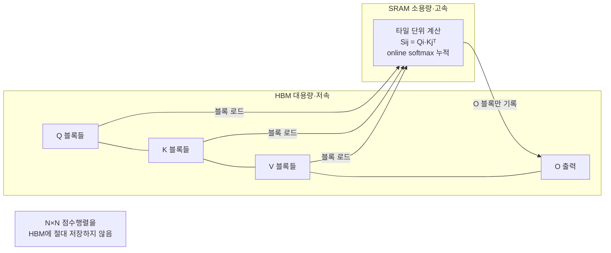
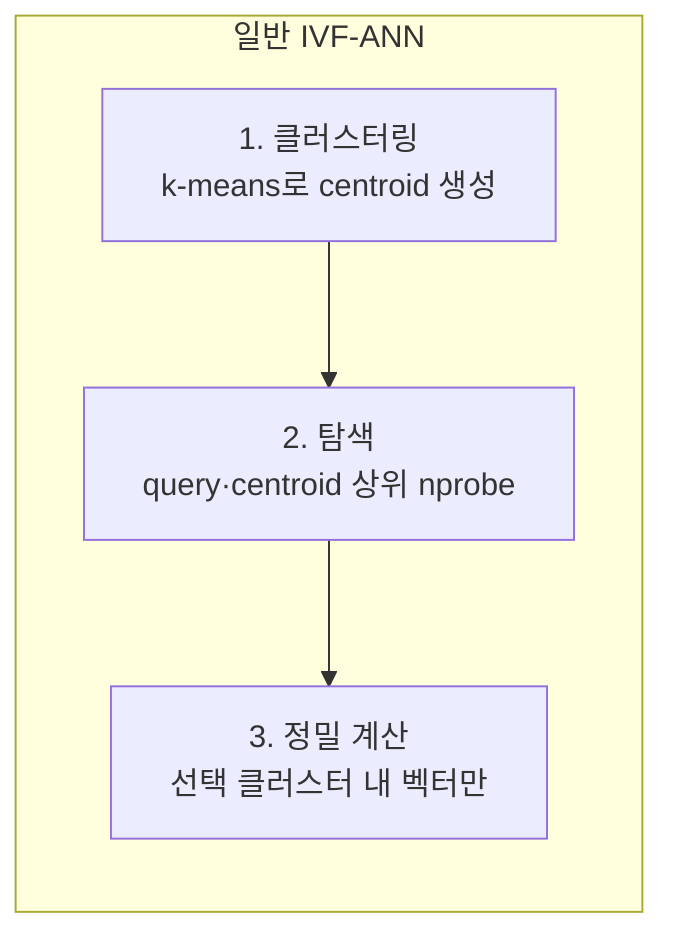

# RetroInfer 세미나 보충 노트 (Supplementary Notes)

발표 자료(`RetroInfer_세미나.pptx`)에서 언급한 개념들을 더 깊이 설명하는 노트입니다. 슬라이드는 요약이고, 이 문서는 그 배경·원리·코드 연결을 자세히 다룹니다.

## 목차
1. [FlashAttention](#1-flashattention)
2. [ANN (근사 최근접 이웃 탐색)](#2-ann-근사-최근접-이웃-탐색)

---

## 1. FlashAttention

> 발표 자료 연관 슬라이드: **2 (문제 정의)**, **10 (성능 비교의 기준선)**, **11 (의존성 `flash-attn 2.7.3`)**

### 1.1 왜 중요한가 — RetroInfer에서의 위치

FlashAttention은 RetroInfer 이야기에서 두 가지 역할을 합니다.

1. **성능 비교의 기준선(baseline)**: RetroInfer가 보고하는 "디코딩 처리량 4.5–10.5× 향상"은 **FlashAttention 대비** 수치입니다. 즉 FlashAttention은 "정확 어텐션의 최적화된 표준"이고, RetroInfer는 그보다 더 나아가 *희소성*까지 활용합니다.
2. **실제 실행 의존성**: RetroInfer 코드도 FlashAttention(및 그 파생 포크)을 **직접 사용**합니다.
   - Prefill: `attn_hub/full_attn.py`의 `full_prefill_attn` → `flash_attn_with_kvcache`
   - Decode(정확 존): `weighted_flash_decoding`(Starmys의 weighted flash-attention 포크)
   - 기준선 실행: `attn_type='Full_Flash_Attn'` 경로 전체

따라서 FlashAttention을 이해하면 "RetroInfer가 무엇을 이어받고, 어디서 더 나아갔는지"가 명확해집니다.

### 1.2 표준 어텐션의 진짜 병목 — 계산이 아니라 메모리 IO

셀프 어텐션의 정의는 다음과 같습니다 (Q, K, V ∈ ℝ^{N×d}, N=시퀀스 길이, d=head_dim):

```
S = Q Kᵀ / √d        # (N × N) 점수 행렬
P = softmax(S)        # 행 단위 softmax
O = P V               # (N × d) 출력
```

순진한 구현의 문제는 **중간 행렬 S, P가 N×N** 이라는 점입니다.

- **메모리**: N=128K면 S는 128K×128K → 수십 GB. 물리적으로 GPU에 올릴 수 없음.
- **속도**: 실제 병목은 FLOPs가 아니라 **HBM(고대역폭 메모리) ↔ SRAM 사이의 데이터 이동(IO)** 입니다. S, P를 HBM에 썼다가 다시 읽는 왕복이 전체 시간을 지배합니다. 즉 어텐션은 **memory-bound(메모리 바운드)** 연산입니다.

### 1.3 핵심 아이디어 — 타일링 + 온라인 소프트맥스 + 재계산

FlashAttention(Dao et al., 2022)의 통찰: **N×N 행렬을 절대 통째로 만들지 않는다.** IO를 의식하는(IO-aware) 방식으로, 블록 단위로 잘라 SRAM 안에서 처리합니다.

세 가지 기법이 결합됩니다.

1. **타일링(Tiling)**: Q, K, V를 블록으로 나눠, 한 번에 한 블록 쌍(Qᵢ, Kⱼ, Vⱼ)만 SRAM으로 올려 부분 어텐션을 계산합니다.
2. **온라인 소프트맥스(Online softmax)**: 전체 행을 보지 않고도, K/V 블록을 순회하며 **running max와 running sum을 갱신**해 정확한 softmax 결과를 누적합니다(아래 1.4).
3. **재계산(Recomputation)**: 역전파(backward) 시 거대한 P를 저장하지 않고, 저장해 둔 통계값(m, ℓ)으로 필요할 때 다시 계산합니다. 저장 공간 O(N²) → O(N).

결과: **HBM 접근이 O(N²/√M) 수준으로 감소**(M=SRAM 크기)하고, 중간 행렬을 저장하지 않아 메모리가 O(N)으로 떨어집니다. 수학적으로는 표준 어텐션과 **완전히 동일한 결과**(근사가 아님)를 냅니다.



### 1.4 온라인 소프트맥스 — 어떻게 한 번에 안 보고도 정확한가

softmax는 원래 **행 전체의 max와 합**이 필요합니다. FlashAttention은 K/V 블록을 순회하며 이를 점진적으로 갱신합니다. j번째 블록을 처리할 때:

```
mᵢ_new = max(mᵢ_old, rowmax(Sᵢⱼ))                     # running max 갱신
ℓᵢ_new = e^(mᵢ_old − mᵢ_new)·ℓᵢ_old + rowsum(e^(Sᵢⱼ − mᵢ_new))
Oᵢ_new = e^(mᵢ_old − mᵢ_new)·Oᵢ_old + e^(Sᵢⱼ − mᵢ_new)·Vⱼ
```

- `m`(running max)은 지수 폭발을 막는 **수치 안정화** 항입니다.
- 새 블록에서 더 큰 max가 나오면, 이전까지 누적한 `ℓ`과 `O`를 `e^(mᵢ_old − mᵢ_new)` 배로 **재스케일(rescale)** 해 보정합니다.
- 모든 블록을 처리한 뒤 `Oᵢ / ℓᵢ`로 정규화하면 표준 softmax 어텐션과 **정확히 같은** 결과가 됩니다.

> 이 "running max + running sum + 재스케일" 패턴은 RetroInfer에도 그대로 나타납니다. `cache_hub/retroinfer_cache.py`의 `sparse_attention`은 **estimation 존의 부분 결과(`es_out`, `es_lse`)를 retrieval/steady 존 계산에 online-softmax로 병합**하는데, 여기서 `lse`(log-sum-exp)가 바로 위의 `m`, `ℓ` 통계에 해당합니다. 즉 3-zone을 정확하게 합치는 수학이 FlashAttention의 온라인 소프트맥스와 동일한 원리입니다.

### 1.5 FlashAttention-2에서 달라진 점

RetroInfer가 고정한 버전은 `flash-attn==2.7.3`입니다. v2(Dao, 2023)는 v1 대비:

- **비-matmul 연산 감소**: 재스케일 횟수를 줄이고, Tensor Core가 잘하는 matmul 비중을 높임.
- **작업 분할(work partitioning) 개선**: 시퀀스 길이 축으로 병렬화를 강화해 SM 점유율(occupancy)을 높임.
- **워프 단위 분할 최적화**: 공유 메모리 접근·동기화 비용 절감.

결과적으로 A100에서 이론 FLOPs의 50–70%대까지 도달합니다. 다만 이 최적화는 **Ampere 이상(sm_80+)의 Tensor Core**를 전제로 합니다 → 발표 자료 슬라이드 11의 "Pascal 등 구형 GPU 불가"의 한 축입니다.

### 1.6 디코딩용 변형 — `flash_attn_with_kvcache`

학습(prefill)은 긴 Q에 대한 어텐션이지만, **자기회귀 디코딩**은 매 스텝 **Q 길이가 1**(새 토큰 1개)이고 K/V는 캐시에 누적됩니다. `flash_attn_with_kvcache`는 이 상황에 특화된 커널로:

- KV 캐시를 in-place로 유지하며 새 토큰의 K/V를 이어 붙이고,
- 길이 1 쿼리에 대해 전체 KV와 어텐션을 IO 효율적으로 계산합니다.

RetroInfer의 `attn_hub/full_attn.py`가 이를 그대로 사용합니다:

```python
# full_decode_attn: valid_len으로 캐시 유효 길이를 넘겨 1토큰 디코딩
attn_out = flash_attn_with_kvcache(q=query_states, k_cache=..., v_cache=..., cache_seqlens=valid_len)
```

### 1.7 FlashAttention의 한계 → RetroInfer의 출발점

FlashAttention은 **어텐션을 IO 효율적으로 만들었지만, 여전히 "전량 어텐션"** 입니다. 즉 디코딩 1스텝마다 **모든 과거 KV 토큰**을 읽고 계산합니다.

- 계산·메모리 접근이 컨텍스트 길이 N에 **선형(O(N))** 으로 증가.
- 128K~1M 토큰에서는 이 선형 비용조차 처리량을 크게 떨어뜨리고, KV 캐시가 GPU 메모리를 압도.

RetroInfer는 여기서 한 걸음 더 나갑니다 — **어텐션의 희소성**을 이용해 "관련 있는 소수 토큰만" 검색(retrieval)합니다. FlashAttention이 *같은 계산을 더 빠르게* 했다면, RetroInfer는 *불필요한 계산을 아예 하지 않는* 방향입니다. 그래서 정확 어텐션(FlashAttention) 대비 4.5–10.5× 처리량이 가능합니다.

| 구분 | FlashAttention | RetroInfer |
|---|---|---|
| 접근 방식 | 전량 어텐션을 IO 효율적으로 | 관련 토큰만 검색(희소) |
| 디코딩 스텝당 비용 | O(N) (모든 KV) | ≈ O(budget × N) (일부 클러스터) |
| 결과 | 표준과 정확히 동일 | 정확도 보장 근사(3-zone) |
| KV 저장 | 전부 GPU | CPU 대용량 + GPU 작업 버퍼 |
| RetroInfer 내 역할 | 기준선 + prefill/정확존 커널 | 시스템 전체 |

### 1.8 한 줄 정리

**FlashAttention** = "N×N 행렬을 만들지 않고, 타일링 + 온라인 소프트맥스로 어텐션을 IO 효율적으로 계산하는 정확 알고리즘." RetroInfer는 이 위에서 *희소 검색*을 얹어, 정확 어텐션의 표준(FlashAttention)을 처리량 기준선으로 넘어섭니다.

### 참고문헌
- Dao et al., *FlashAttention: Fast and Memory-Efficient Exact Attention with IO-Awareness*, NeurIPS 2022. [arXiv:2205.14135](https://arxiv.org/abs/2205.14135)
- Dao, *FlashAttention-2: Faster Attention with Better Parallelism and Work Partitioning*, 2023. [arXiv:2307.08691](https://arxiv.org/abs/2307.08691)
- 코드: [`attn_hub/full_attn.py`](../attn_hub/full_attn.py), [`cache_hub/retroinfer_cache.py`](../cache_hub/retroinfer_cache.py)

---

## 2. ANN (근사 최근접 이웃 탐색)

> 발표 자료 연관 슬라이드: **3 (핵심 통찰)**, **6 (Wave Index)**

**ANN = Approximate Nearest Neighbor search (근사 최근접 이웃 탐색)**. RetroInfer의 "KV 캐시를 벡터 저장 시스템으로 다룬다"는 발상의 이론적 뿌리입니다.

### 2.1 왜 어텐션이 ANN 문제인가

디코딩 한 스텝에서 어텐션이 하는 일을 다시 보면:

```
S = q · Kᵀ / √d      # 현재 query q(1개)와 모든 key의 내적
P = softmax(S)        # 큰 점수일수록 큰 가중치
O = P · V             # 가중합
```

softmax는 **점수가 큰 소수의 key에 가중치를 몰아줍니다**(지수 함수의 성질). 즉 출력 O에 실질적으로 기여하는 것은 `q`와 내적이 큰 = **q에 가장 가까운(방향이 비슷한) 소수의 key** 뿐입니다.

> "query와 내적이 큰 상위 몇 개의 벡터를 찾아라" — 이것이 정확히 **최근접 이웃 탐색(NN search)** 의 정의입니다. (내적/코사인 유사도 기준의 Maximum Inner Product Search, MIPS)

그런데 정확한 NN(모든 key와 내적)을 매번 하면 결국 전량 어텐션과 같아집니다. 그래서 **근사(Approximate)** 를 씁니다 — 약간의 누락을 감수하고 훨씬 빠르게 "충분히 좋은" 상위 후보를 찾습니다. 이것이 ANN입니다.

### 2.2 정확 NN vs 근사 ANN — 재현율/지연 트레이드오프

| | 정확 NN (brute force) | 근사 ANN |
|---|---|---|
| 방식 | 모든 벡터와 거리 계산 | 인덱스로 후보만 계산 |
| 비용 | O(N) — 느림 | O(N보다 훨씬 작음) — 빠름 |
| 정확도 | 100% | **재현율(recall) < 100%** (일부 진짜 이웃 누락 가능) |

ANN의 핵심 지표는 **재현율(recall)** = "진짜 상위 k개 중 몇 개를 실제로 찾았나". 인덱스를 더 많이 탐색할수록 recall↑·지연↑. 시스템은 이 **재현율 ↔ 지연 트레이드오프**를 조절합니다. RetroInfer에서는 `retrieval_budget`이 바로 이 조절 손잡이입니다.

### 2.3 대표적 ANN 인덱스 방식

| 방식 | 아이디어 | RetroInfer 관련성 |
|---|---|---|
| **IVF (Inverted File)** | 벡터를 클러스터로 나누고, query와 가까운 몇 개 클러스터(nprobe)만 탐색 | ✅ **RetroInfer의 wave index가 이 방식** |
| HNSW (그래프) | 이웃 그래프를 따라 탐색 | 그래프 유지 비용이 커 동적 KV에 부적합 |
| PQ (Product Quantization) | 벡터를 압축해 근사 거리 계산 | 메모리 절약형, RetroInfer의 estimation과 발상 유사 |

RetroInfer는 **IVF(Inverted File Index)** 계열을 채택합니다. 긴 컨텍스트에서 매 스텝 인덱스를 쓰고 갱신해야 하므로, 구축·갱신이 저렴한 클러스터링 기반이 적합하기 때문입니다.

### 2.4 IVF 흐름과 RetroInfer의 wave index 대응

일반적인 IVF-ANN의 3단계와 RetroInfer 구현이 정확히 대응됩니다.



| IVF 단계 | RetroInfer 구현 | 코드 |
|---|---|---|
| ① 클러스터링(색인 구축) | segmented k-means로 KV를 클러스터화, centroid 생성 | `cache_hub/kmeans.py`의 `segment_k_means` |
| ② 탐색(coarse search) | `Softmax(Q·Cᵀ)` → top-k 클러스터 선택 | `batch_gemm_softmax` + `topk` |
| ③ 정밀 계산 | 선택 클러스터의 실제 KV로 어텐션 | `weighted_flash_decoding` |

- **centroid** = 클러스터 대표 벡터 = IVF의 "coarse quantizer" 엔트리.
- **nprobe** = 탐색할 클러스터 수 = `⌈n_centroids × retrieval_budget⌉` (발표 슬라이드 6).

### 2.5 RetroInfer가 일반 ANN과 다른 점

RetroInfer의 wave index는 표준 IVF를 그대로 쓰지 않고 **어텐션에 특화**했습니다. 그래서 이름도 "**A**ttention-a**W**are **VE**ctor index".

1. **어텐션 인식(Attention-aware)**: 거리(L2)가 아니라 어텐션 점수(내적+softmax)를 직접 기준으로 클러스터를 선택합니다.
2. **정확도 보장(Accuracy-bounded)**: 일반 ANN은 nprobe 밖 클러스터를 그냥 버려 recall이 떨어집니다. RetroInfer는 **estimation 존**으로 나머지 클러스터를 centroid로 *근사 추정*해 합칩니다 → 누락으로 인한 오차에 경계를 둡니다(발표 슬라이드 5). 즉 "버리는" 대신 "싸게 근사"합니다.
3. **동적 갱신**: 디코딩 중 새 토큰이 생기면 인덱스를 증분 갱신합니다(`nprobe_new`, `update_kv`). 정적 벡터 DB용 ANN과 달리 KV는 계속 늘어나기 때문입니다.
4. **공간적 지역성 활용**: 어텐션은 인접 토큰이 비슷한 패턴을 보이므로, **segmented** k-means로 세그먼트별 클러스터링해 구축 비용을 낮춥니다.

### 2.6 왜 이 관점이 강력한가

KV 캐시를 "벡터 DB"로 보는 순간, 수십 년간 발전한 **벡터 검색(vector search) 기술**을 LLM 추론에 그대로 이식할 수 있습니다. RetroInfer라는 이름의 다른 축(`RetrievalAttention`)이 바로 이 지점 — "어텐션을 **검색(retrieval)** 문제로 환원"하는 것입니다.

- 정확 어텐션(FlashAttention): 모든 key를 본다 → O(N)
- ANN 관점(RetroInfer): 관련 key만 검색한다 → O(budget × N), recall은 estimation으로 보정

### 2.7 한 줄 정리

**ANN** = "정확한 최근접 이웃을 약간의 누락을 감수하고 훨씬 빠르게 찾는 검색." 어텐션은 본질적으로 "query에 가까운 key 찾기"라는 ANN 문제이고, RetroInfer는 이를 **IVF 방식의 wave index + 정확도 보장 estimation**으로 구현해, 긴 컨텍스트에서 계산량을 budget 비율만큼으로 줄입니다.

### 참고문헌
- Johnson et al., *Billion-scale similarity search with GPUs (Faiss)*, 2017. [arXiv:1702.08734](https://arxiv.org/abs/1702.08734) — IVF/PQ ANN의 대표 구현
- Liu et al., *RetrievalAttention: Accelerating Long-Context LLM Inference via Vector Retrieval*, 2024. [arXiv:2409.10516](https://arxiv.org/abs/2409.10516)
- 코드: [`cache_hub/kmeans.py`](../cache_hub/kmeans.py), [`cache_hub/retroinfer_cache.py`](../cache_hub/retroinfer_cache.py)
