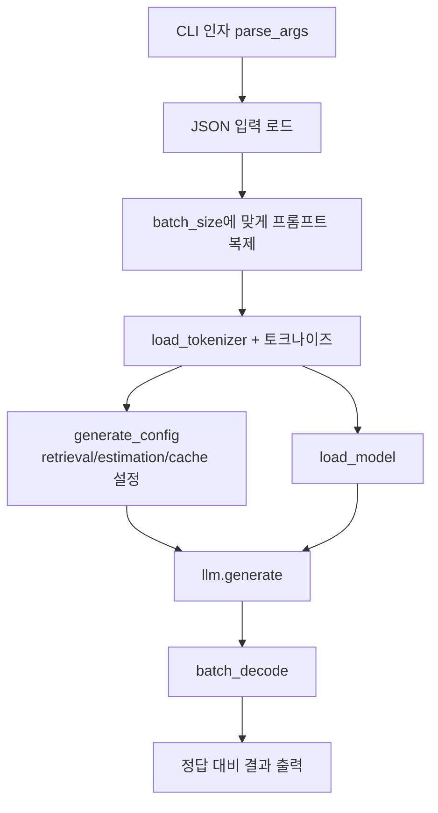

# `simple_test.py` 분석

## 개요
RetroInfer 환경이 올바르게 구성되었는지 검증하는 **데모/엔트리포인트 스크립트**입니다. RULER류 긴 컨텍스트(약 120K 토큰) 입력을 로드해, 지정한 어텐션 방식(`RetroInfer` 또는 `Full_Flash_Attn`)으로 LLM 생성을 수행하고 결과를 출력합니다.

## 주요 구성 요소
| 함수 | 역할 |
|---|---|
| `set_seed(seed)` | Python/NumPy/torch(및 CUDA)의 난수 시드를 2025로 고정해 재현성 확보 |
| `parse_args()` | CLI 인자 파싱. `add_model_args`(model_hub)와 `add_config_args`(config)를 합쳐 모델·희소성 설정 인자를 흡수 |
| `__main__` | 데이터 로드 → 토크나이즈 → 설정 생성 → 모델 로드 → `llm.generate` → 디코딩·출력 |

## 핵심 흐름
1. `--data_path`의 JSON(`[{"input","outputs"}, ...]`)을 읽어 `batch_size`에 맞게 복제.
2. `load_tokenizer`로 토크나이즈, 입력 길이 `input_len` 계산, `max_len = input_len + gen_len`.
3. `generate_config(...)`로 `retrieval_budget`/`estimation_budget`/`cache_ratio` 등을 담은 어텐션 설정 생성.
4. `load_model(...)`로 모델 인스턴스화 후 `llm.generate(...)` 호출(샘플링 파라미터 temperature=0.6/top_p=0.95/top_k=20 고정).
5. `tokenizer.batch_decode`로 텍스트화, 정답(groundtruth)과 함께 출력.

## 블록 다이어그램

## 의존성 · 주의
- `model_hub`, `config`에 의존. 실행 시 CUDA GPU 필요(`torch.cuda.manual_seed`, `.to(llm.layers[0].device)`).
- `--dtype`으로 `fp16`/`bf16` 선택, `--prefill_method`로 `full`/`xattn`/`minfer` 선택.
- 데모 기본 실행에는 약 35GB GPU + 70GB CPU 메모리가 필요(README 기준).
