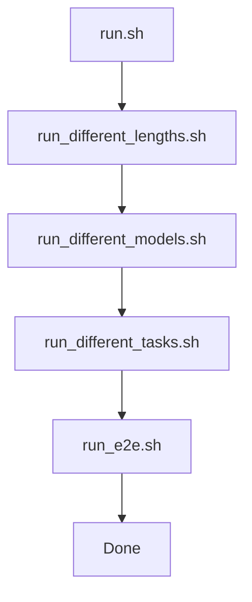

# `throughput_eval/run.sh` 분석

## 개요
처리량(throughput) 실험 전체를 순차 실행하는 **오케스트레이터 스크립트**입니다. 4개의 하위 실험 스크립트를 차례로 호출합니다.

## 실행 순서
| 단계 | 스크립트 | 내용 |
|---|---|---|
| 1 | `run_different_lengths.sh` | 컨텍스트 길이별 처리량 |
| 2 | `run_different_models.sh` | 모델별 처리량 |
| 3 | `run_different_tasks.sh` | 태스크별 처리량 |
| 4 | `run_e2e.sh` | 종단간(prefill+decode) 처리량 |

## 블록 다이어그램

## 의존성 · 주의
- 4개 하위 스크립트 및 `test.py`/`test_vllm.py`에 의존. CUDA GPU + `numactl` 필요.
- 논문 처리량 수치 재현용(README의 throughput 재현 절차).
