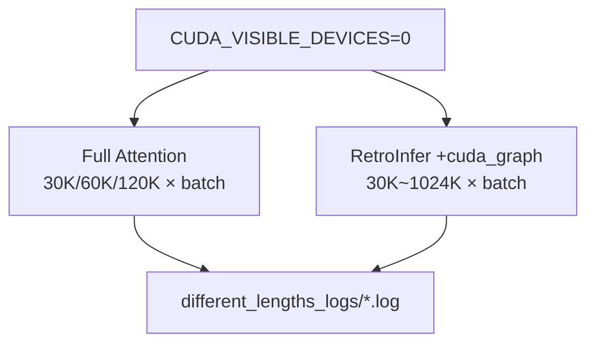

# `throughput_eval/run_different_lengths.sh` 분석

## 개요
**컨텍스트 길이별 처리량**을 측정하는 실험 스크립트입니다. Llama-3-8B-1048K 모델로 Full Attention과 RetroInfer를 여러 컨텍스트 길이(30K/60K/120K/1024K)와 배치 크기 조합으로 반복 실행하고 로그를 저장합니다.

## 핵심 로직
- `CUDA_VISIBLE_DEVICES=0`으로 단일 GPU 고정(대배치는 `--membind=0,1`로 2 NUMA 노드 사용).
- **Full Attention**: 30K/60K/120K, 배치 최대 4~16(길수록 작은 배치).
- **RetroInfer**(`--use_cuda_graph`): 동일 길이에서 훨씬 큰 배치(최대 128) + 초장문 1024K까지.
- 각 (길이, batch, round=1·2) 조합을 `test.py`로 실행, `different_lengths_logs/`에 로그 기록.

## 블록 다이어그램

## 의존성 · 주의
- `test.py`, `numactl` 필요. CUDA GPU(대배치·장문은 다중 GPU/NUMA) 필요.
- RetroInfer가 같은 길이에서 Full 대비 훨씬 큰 배치를 소화함을 보이는 것이 목적.
