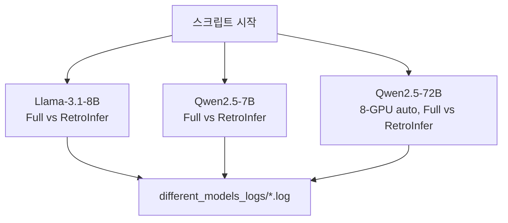

# `throughput_eval/run_different_models.sh` 분석

## 개요
**모델별 처리량**을 측정하는 실험 스크립트입니다. 120K 컨텍스트에서 Llama-3.1-8B, Qwen2.5-7B, Qwen2.5-72B에 대해 Full Attention과 RetroInfer 처리량을 비교합니다.

## 핵심 로직
- 8B/7B 모델은 단일 GPU(`CUDA_VISIBLE_DEVICES=0`), 대배치는 `--membind=0,1`(또는 0,1,2)로 다중 NUMA.
- **72B 모델**은 `CUDA_VISIBLE_DEVICES=0..7` + `--device auto`로 8-GPU 분산.
- 각 모델·어텐션·배치·round 조합을 `test.py`로 실행, `different_models_logs/`에 로그 저장.

## 블록 다이어그램

## 의존성 · 주의
- `test.py`, `numactl` 필요. 72B는 다중 GPU 필수(최소 3장 이상).
- RetroInfer(`--use_cuda_graph`)가 모델 규모와 무관하게 처리량 이점을 유지함을 보이는 실험.
