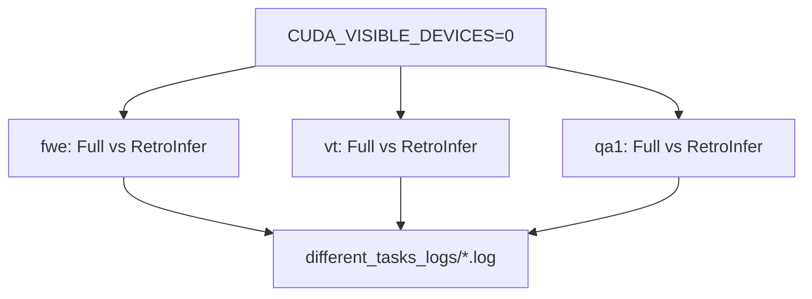

# `throughput_eval/run_different_tasks.sh` 분석

## 개요
**태스크별 처리량**을 측정하는 실험 스크립트입니다. Llama-3-8B-1048K로 세 가지 태스크(`fwe`, `vt`, `qa1`)에서 Full Attention과 RetroInfer 처리량을 비교합니다.

## 핵심 로직
- `CUDA_VISIBLE_DEVICES=0` 단일 GPU(대배치는 `--membind=0,1`).
- 각 태스크에 대해 Full Attention(배치 1·4)과 RetroInfer(`--use_cuda_graph`, 배치 1·32)를 round 1·2로 실행.
- 로그는 `different_tasks_logs/`에 저장.

## 블록 다이어그램

## 의존성 · 주의
- `test.py`, `numactl` 필요. CUDA GPU 필요.
- 처리량 이점이 특정 태스크에 국한되지 않음을 보이는 실험.
