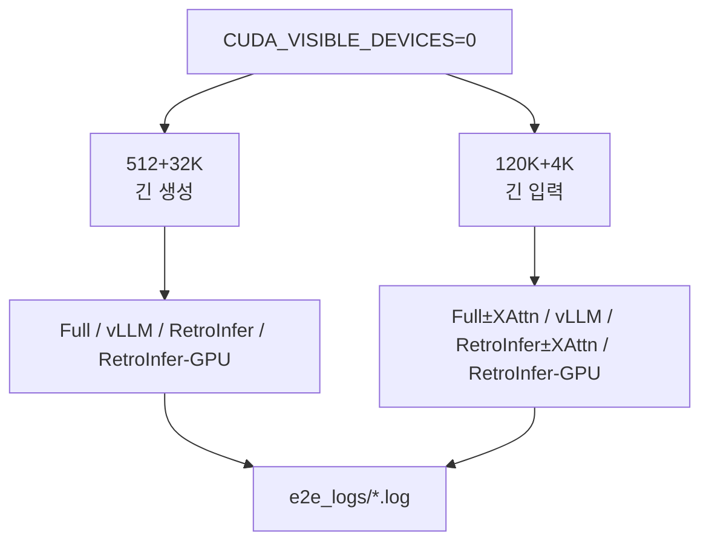

# `throughput_eval/run_e2e.sh` 분석

## 개요
**종단간(end-to-end) 처리량**을 측정하는 실험 스크립트입니다. 두 가지 시나리오(짧은 입력+긴 생성 `512+32K`, 긴 입력+짧은 생성 `120K+4K`)에서 Full Attention / vLLM(베이스라인) / RetroInfer / RetroInfer-GPU를 비교합니다. prefill 방법으로 XAttention도 포함합니다.

## 핵심 로직
- **512+32K**(DeepSeek-R1-Distill-Llama-8B, AIME, gen_len=32768): Full / vLLM / RetroInfer / RetroInfer-GPU.
- **120K+4K**(Llama-3-8B-1048K, NIAH, gen_len=4096): Full / Full+XAttention / vLLM / RetroInfer / RetroInfer+XAttention / RetroInfer-GPU.
- vLLM·초대배치 구간은 `PYTORCH_CUDA_ALLOC_CONF=expandable_segments:True`로 메모리 단편화 완화.
- 각 조합을 round 1·2로 `test.py`(또는 `test_vllm.py`)로 실행, `e2e_logs/`에 로그 저장.

## 블록 다이어그램

## 의존성 · 주의
- `test.py`, `test_vllm.py`, `numactl` 필요. CUDA GPU + vLLM 설치 필요.
- RetroInfer vs vLLM 종단간 처리량 비교가 핵심(논문 수치 재현).
