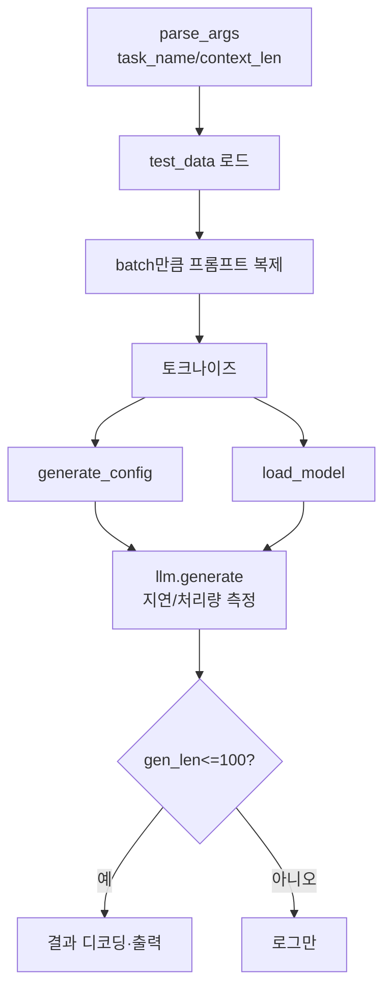

# `throughput_eval/test.py` 분석

## 개요
RetroInfer의 **처리량(throughput) 측정용 실행 스크립트**입니다. `simple_test.py`와 구조가 비슷하지만, 미리 준비된 처리량 벤치 데이터(`throughput_eval/test_data/`의 NIAH/fwe/vt/qa1/AIME)를 로드하고, 논문 수치 재현을 위해 지연/처리량을 측정하는 데 초점을 둡니다.

## 주요 구성 요소
| 구성 | 역할 |
|---|---|
| `set_seed(2025)` | 재현성 |
| `parse_args()` | `--batch_size`, `--prefill_bsz`, `--prefill_method`, `--context_len`, `--gen_len`, `--task_name` + 모델/설정 인자 |
| `__main__` | 데이터 로드 → 토크나이즈 → `generate_config` → `load_model` → `llm.generate` |

## `simple_test.py`와의 차이
- 입력을 `task_name`(NIAH_{context_len}.json 등)으로 고정 로드(단일 프롬프트를 batch만큼 복제).
- `dtype`을 bf16으로 고정, `do_sample=False`, `ignore_eos=True`(순수 처리량 측정).
- `gen_len <= 100`일 때만 결과를 디코딩·출력(그 외엔 지연/처리량 로그가 핵심).

## 블록 다이어그램

## 주의
- `throughput_eval/run_e2e.sh`가 이 스크립트(`test.py`)와 vLLM 기준선(`test_vllm.py`)을 함께 실행해 비교합니다.
- 실행에 CUDA GPU 필요. `numactl`로 NUMA 바인딩되어 호출됩니다.
