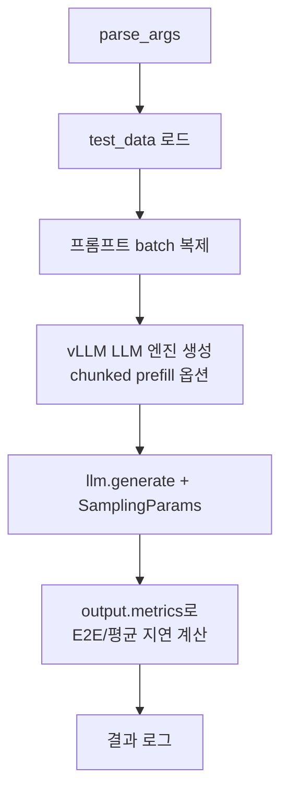

# `throughput_eval/test_vllm.py` 분석

## 개요
RetroInfer의 처리량을 비교할 **기준선(baseline)으로 표준 vLLM 엔진을 실행**하는 스크립트입니다. 동일한 입력·생성 길이로 vLLM의 종단간 지연/평균 지연을 측정해, RetroInfer(`test.py`) 대비 속도 향상을 정량화합니다. RetroInfer 코드 경로와는 독립적입니다.

## 주요 구성 요소
| 구성 | 역할 |
|---|---|
| `parse_args()` | `--batch_size`, `--gen_len`, `--model_name`, `--chunk_size`, `--context_len`, `--task_name` |
| `LLM(...)` (vLLM) | `max_model_len`, `gpu_memory_utilization=0.96`, chunked prefill 옵션으로 엔진 생성 |
| `SamplingParams` | `max_tokens=gen_len`, `ignore_eos=True`, `temperature=0` (결정적, 순수 처리량) |
| 측정 | `output.metrics`(arrival/first_token/finished_time)로 E2E·평균 지연 계산 |

## 핵심 로직
- `chunk_size > 0`이면 chunked prefill(`enable_chunked_prefill=True`, `max_num_batched_tokens=chunk_size`) 활성화.
- 배치별 `finished_time - arrival_time` 합으로 평균 지연(`s/req`) 산출.

## 블록 다이어그램

## 의존성 · 주의
- `vllm==0.6.5`에 의존(V0 엔진 API `output.metrics` 사용). torch 2.5.1/cu124 스택과 정합.
- RetroInfer의 핵심 의존성이 아니며, `throughput_eval`에서만 사용됩니다. Ampere GPU 권장.
